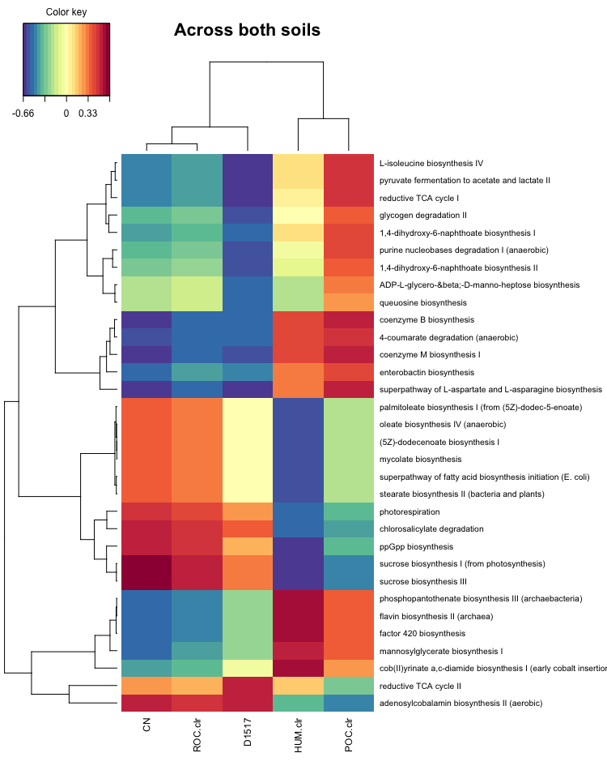
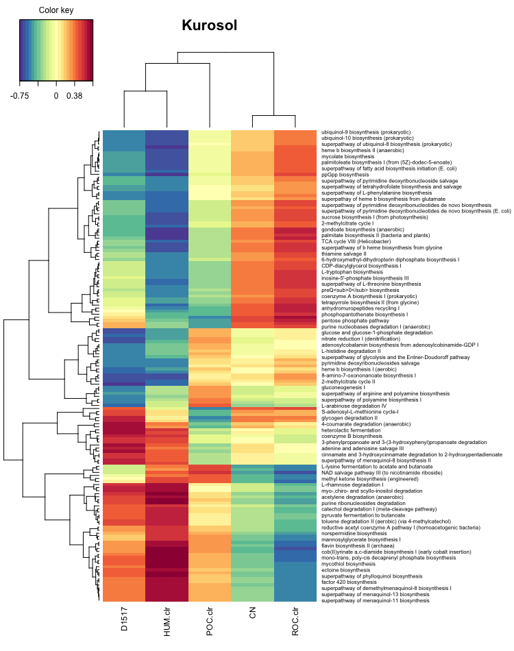
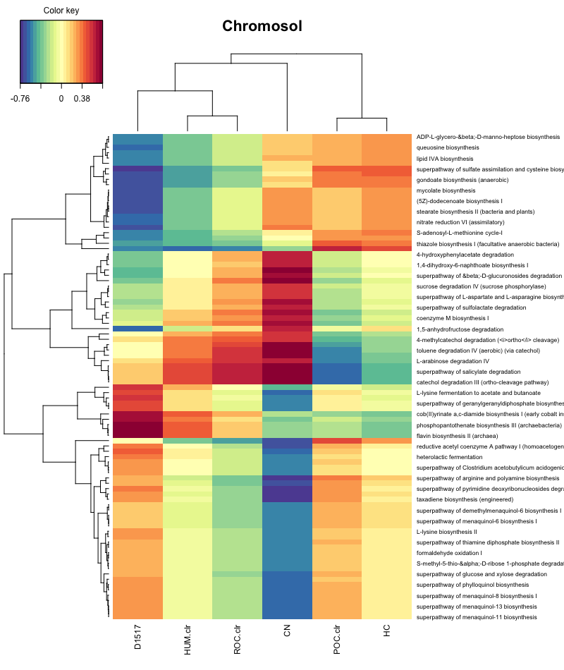
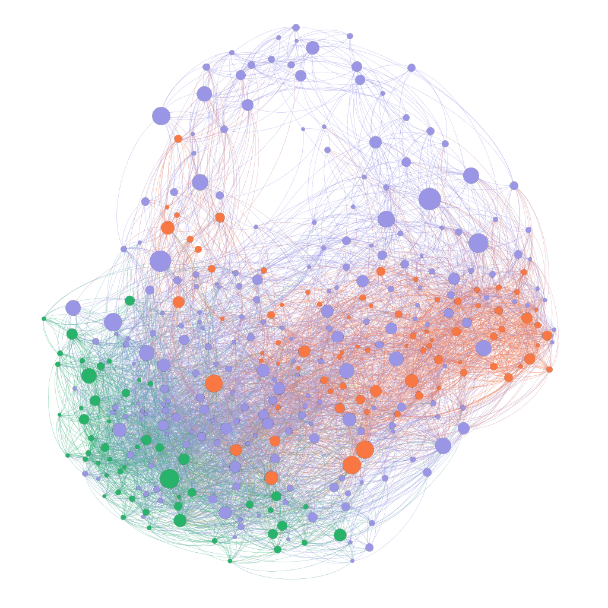
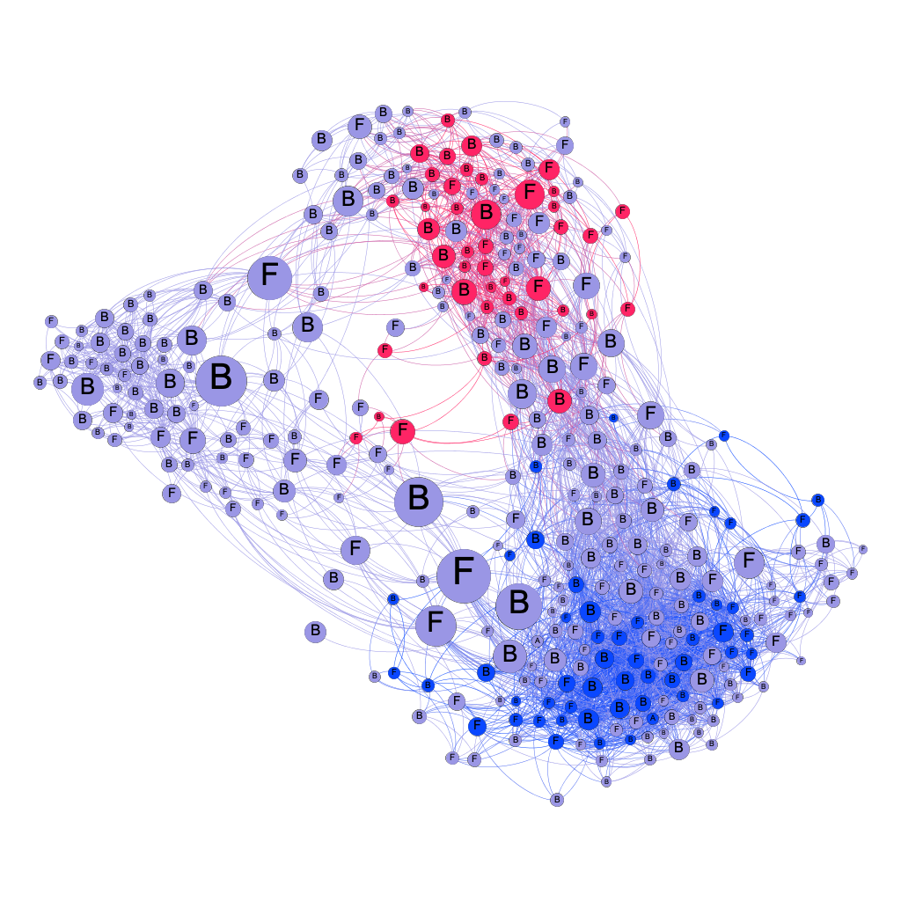
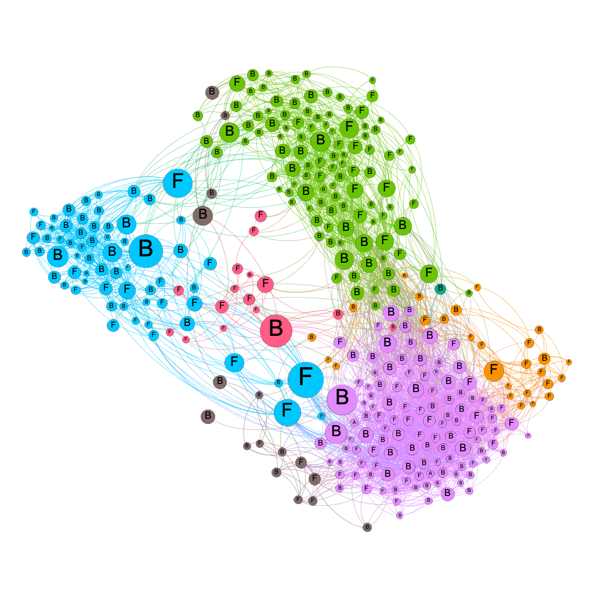
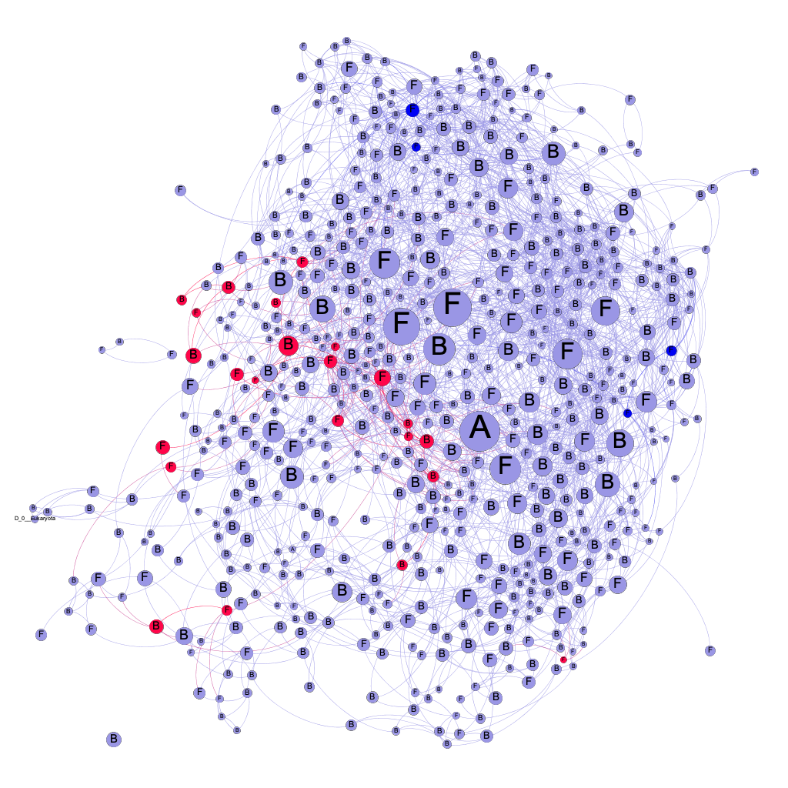
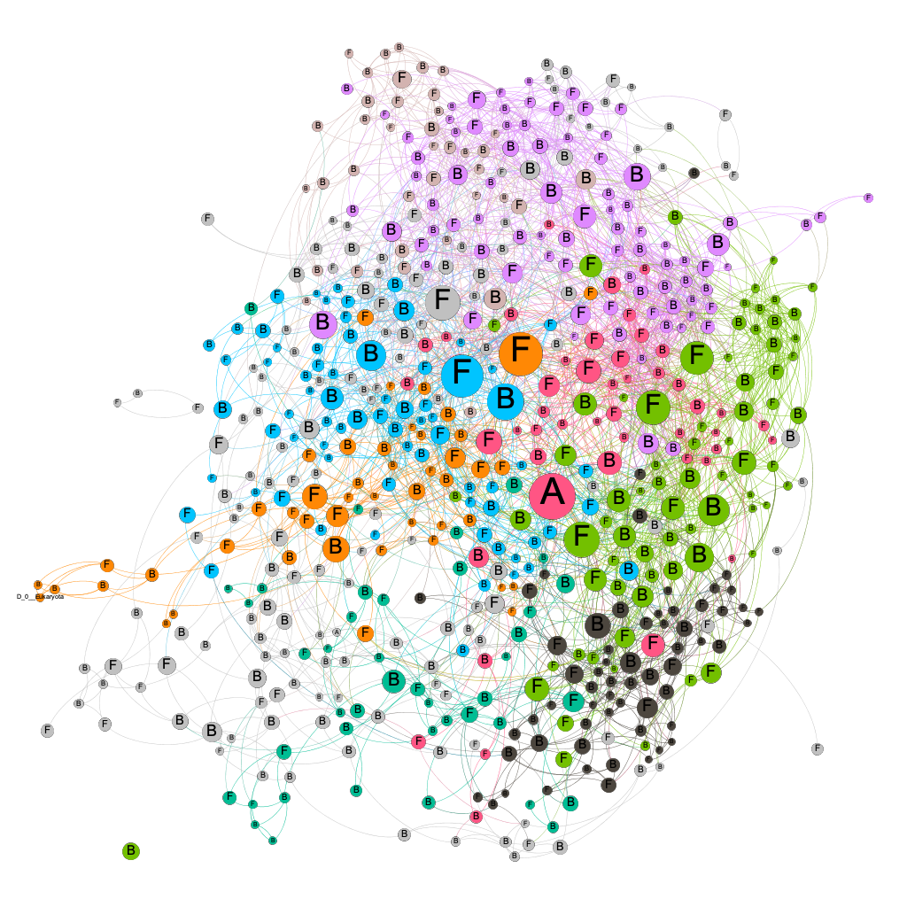

```{r load-packages, include=TRUE, echo=FALSE,warning=FALSE, message=FALSE}
save.image("workspace.RData")
library(ggrepel)
library(qiime2R)
library(tidyverse)
library(stringr)
library(ggplot2)
theme_set(theme_bw())  
library(vegan)
library(ggpubr)
library(phyloseq)
library(psych)
library(reshape2)
library(ggfortify)
library(factoextra)
library(knitr)
library(microbiome)
library(SpiecEasi)
library(bookdown)
library(tinytex)
library(metagMisc)
options(kableExtra.auto_format = FALSE)
library(kableExtra)
library(magick)
#library(flextable)
```


```{r metadata, include=TRUE, echo=FALSE, warning=FALSE, message=FALSE, cache = TRUE}
metadata<-read_tsv("~/Documents/Study/LaTrobe/Research/phD/Milestone2_Field_Survey/M2_Bacteria/M2_Qiime_output_Bacteria2020run/metadata.tsv") #requires tidyverse
metadata2 <- metadata[c(2:37),]
# Converting columns to numeric using "tidyverse"
metadata2 <- metadata[c(2:37),] %>%
  rownames_to_column("spl")%>%
  mutate_all(type.convert) %>%
  mutate_if(is.factor, as.character)%>%
  column_to_rownames("spl")
# Add clr transformed carbon composition
# Compute percentage frequencies
percentData <- data.frame(metadata2[c(32:35,37)])
sum_c <- apply(percentData, 1, sum) #Equates to TOC
percentData <- 100*percentData/sum_c 
percentData <- round(percentData, 2) # Round the sorted output to 1 digit
percentData$`#SampleID` <- metadata2$`#SampleID`
percentData <- percentData %>% rename(HUM.pct = HUM) %>% rename(POC.pct = POC ) %>% rename(ROC.pct = ROC) %>% rename(Delta.C.Frac.pct = Delta.C.Frac)
metadata2 <- metadata2 %>% left_join(percentData, by = "#SampleID") #add percent data
require(compositions)
c_comp <- data.frame(clr(percentData)) %>% dplyr::select(- X.SampleID)
c_comp$`#SampleID` <- metadata2$`#SampleID`
c_comp  <- c_comp %>% rename(HUM.clr = HUM.pct) %>% rename(POC.clr = POC.pct ) %>% rename(ROC.clr = ROC.pct)%>% rename(Delta.C.Frac.clr = Delta.C.Frac.pct)
metadata2 <- metadata2 %>% left_join(c_comp, by = "#SampleID")
#defining factors
metadata2$Soil <- factor(metadata2$Soil, levels=c("Kurosol", "Chromosol"))
metadata2$Paddock <- factor(metadata2$Paddock, 
                            levels=c("1", "2", "3", "4","5", "6","7", "8","9", "10","11", "12"))
metadata2$Dloss_fct <-  factor(metadata2$Dloss_fct, 
                               levels=c("<=30%", "<=50%", "<=70%", ">70%"))
metadata2$Dloss_fct2 <-  factor(metadata2$Dloss_fct2, 
                               levels=c("<=43%", ">43%", "<72%", ">=72%"))
```

```{r physeqb object,include=TRUE, echo=FALSE, warning=FALSE,message=FALSE, cache=TRUE}
SVs <-read_qza("~/Documents/Study/LaTrobe/Research/phD/Milestone2_Field_Survey/M2_Bacteria/M2_Qiime_output_Bacteria2020run/feature_table_insertiontreefiltered.qza")
#SVs2 <-read_qza("~/Documents/Study/LaTrobe/Research/phD/Milestone2_Field_Survey/M2_Bacteria/M2_Qiime_Bacteria/Re_runwithCutadapt2019_28Nov/feature_table_single_bac.qza")
taxonomy <- read_tsv("~/Documents/Study/LaTrobe/Research/phD/Milestone2_Field_Survey/M2_Bacteria/M2_Qiime_output_Bacteria2020run/taxonomy_silva.tsv") %>% filter(Taxon != "categorical")  %>% rename(Feature.ID = `Feature ID`)
#taxonomy <- read_qza("~/Documents/Study/LaTrobe/Research/phD/Milestone2_Field_Survey/M2_Bacteria/M2_Qiime_Bacteria/Re_runwithCutadapt2019_28Nov/taxonomy_gg_M2.qza")
taxtable <- taxonomy %>% as_tibble() %>% separate(Taxon, sep=";", c("Kingdom","Phylum","Class","Order","Family","Genus","Species")) 
tree <- read_qza("~/Documents/Study/LaTrobe/Research/phD/Milestone2_Field_Survey/M2_Bacteria/M2_Qiime_output_Bacteria2020run/insertion-tree.qza")

physeqB <- phyloseq(
  otu_table(SVs$data, taxa_are_rows = T), 
  phy_tree(tree$data), 
  tax_table(as.data.frame(taxtable) %>% dplyr::select(-Confidence) %>% column_to_rownames("Feature.ID") %>% as.matrix()), 
  sample_data(metadata2 %>% as.data.frame() %>% column_to_rownames("#SampleID")))
#take out sample C20 as it failed in this run. 
physeqB <- prune_samples(samples = (sample_names(physeqB)!= c("C20")), physeqB )
physeqB <- prune_taxa(taxa_sums(physeqB) != 0, physeqB)
#adding diversity measures (with ps object) to metadata and re-create ps object 
#here a decision has to be made on sample size. Look at feature-table.qzv to see how many samples are lost with x sample size or how many features are lost with minimum sample size. This is used ONLY for diversity metrics (not differentially abundance anaylyis which I filter separately. So I generally use the minimum samples size if different between min/max is within 10fold. 
print(paste("The minimum number of bacterial sequences before filtering in this data set is",min(colSums(otu_table(physeqB))),"and the maximum number of sequences in this data set is",max(colSums(otu_table(physeqB))) ))

rare_Bac <- rarefy_even_depth(physeqB, sample.size = min(colSums(otu_table(physeqB))),  rngseed = TRUE, replace = TRUE, trimOTUs = TRUE)
ps.div <- estimate_richness(rare_Bac)
ps.div$`#SampleID` <- sample_names(physeqB)
meta.df <- data.frame(sample_data(physeqB))
meta.df <- meta.df %>% rownames_to_column("#SampleID") %>% 
  left_join(ps.div, by = "#SampleID") %>% column_to_rownames("#SampleID")
meta.df$pielou_ev <- ps.div$Shannon/log(ps.div$Observed)      #Pielou eveness
#adding carbon ratios
meta.df <- meta.df %>% rownames_to_column("OTUID") %>%
  mutate(observed_C = Observed / TC) %>%
  mutate(shannon_C = Shannon / TC) %>%
  mutate(simpson_C = InvSimpson / TC) %>% 
  mutate(evenness_C = pielou_ev / TC) %>% 
  mutate(bcop_C = b_copies_ngDNA / TC) %>% 
  mutate(fcop_C  = f_copies_ngDNA / TC) %>% 
  mutate(observed_D17 = Observed / D17) %>%
  mutate(shannon_D17 = Shannon / D17) %>%
  mutate(simpson_D17 = InvSimpson / D17) %>% 
  mutate(evenness_D17 = pielou_ev / D17) %>% 
  mutate(ROC_D17 =ROC / D17) %>% 
  mutate(HUM_D17 = HUM / D17) %>% 
  mutate(POC_D17 = POC / D17) %>% 
  mutate(TC_D17 = TC / D17)  %>% column_to_rownames("OTUID")
physeqB@sam_data <- sample_data(meta.df)
physeqB
```

```{r physeqf object,include=TRUE, echo=FALSE, warning=FALSE,message=FALSE, cache=TRUE}
#FUNGI
SVs <- read_qza("~/Documents/Study/LaTrobe/Research/phD/Milestone2_Field_Survey/M2_Fungi/M2_Qiime_Fungi/feature_table_M2Fungi.qza")
SVs <- SVs$data %>% as.data.frame %>% rename("C01" = "C-1") %>% rename("C02" = "C-2") %>% rename("C03" = "C-3") %>% rename("C04" = "C-4") %>% rename("C05" = "C-5") %>% rename("C06" = "C-6") %>% rename("C07" = "C-7") %>% rename("C08" = "C-8") %>% rename("C09" = "C-9") %>% rename("C10" = "C-10") %>% rename("C11" = "C-11") %>% rename("C12" = "C-12") %>% rename("C13" = "C-13") %>% rename("C14" = "C-14") %>% rename("C15" = "C-15") %>% rename("C16" = "C-16") %>% rename("C17" = "C-17") %>% rename("C18" = "C-18") %>% rename("C19" = "C-19") %>% rename("C20" = "C-20") %>% rename("C21" = "C-21") %>% rename("C22" = "C-22") %>% rename("C23" = "C-23") %>% rename("C24" = "C-24") %>% rename("C25" = "C-25") %>% rename("C26" = "C-26") %>% rename("C27" = "C-27") %>% rename("C28" = "C-28") %>% rename("C29" = "C-29") %>% rename("C30" = "C-30") %>% rename("C31" = "C-31") %>% rename("C32" = "C-32") %>% rename("C33" = "C-33") %>% rename("C34" = "C-34") %>% rename("C35" = "C-35")%>% rename("C36" = "C-36")
    
taxonomy<-read_qza("~/Documents/Study/LaTrobe/Research/phD/Milestone2_Field_Survey/M2_Fungi/M2_Qiime_Fungi/taxonomy_unite-ver8_M2Fungi.qza")
taxtable <- taxonomy$data %>% as_tibble()%>% dplyr::select(-Confidence) %>% separate(Taxon, sep=";", c("Kingdom","Phylum","Class","Order","Family","Genus","Species")) 
physeqF<-phyloseq(
  otu_table(SVs, taxa_are_rows = T), 
  tax_table(as.data.frame(taxtable)  %>% column_to_rownames("Feature.ID") %>% as.matrix()), 
  sample_data(metadata2 %>% as.data.frame() %>% column_to_rownames("#SampleID")))

#adding diversity measures (with ps object) to metadata and re-create ps object 
#here a decision has to be made on sample size. Look at feature-table.qzv to see how many samples are lost with x sample size or how many features are lost with minimum sample size. This is used ONLY for diversity metrics (not differentially abundance anaylyis which I filter separately. So I generally use the minimum samples size if different between min/max is within 10fold. 
print(paste("The minimum number of fungal sequences before filtering in this data set is",min(colSums(otu_table(physeqF))),"and the maximum number of sequences in this data set is",max(colSums(otu_table(physeqF))) ))

rare_Fun <- rarefy_even_depth(physeqF, sample.size = min(colSums(otu_table(physeqF))),  rngseed = TRUE, replace = TRUE, trimOTUs = TRUE)
ps.div <- estimate_richness(rare_Fun)
ps.div$`#SampleID` <- sample_names(physeqF)
meta.df <- data.frame(sample_data(physeqF))
meta.df <- meta.df %>% rownames_to_column("#SampleID") %>% 
  left_join(ps.div, by = "#SampleID") %>% column_to_rownames("#SampleID")
meta.df$pielou_ev <- ps.div$Shannon/log(ps.div$Observed)      #Pielou eveness
#adding carbon ratios
meta.df <- meta.df %>% rownames_to_column("OTUID") %>%
  mutate(observed_C = Observed / TC) %>%
  mutate(shannon_C = Shannon / TC) %>%
  mutate(simpson_C = InvSimpson / TC) %>% 
  mutate(evenness_C = pielou_ev / TC) %>% 
  mutate(bcop_C = b_copies_ngDNA / TC) %>% 
  mutate(fcop_C  = f_copies_ngDNA / TC) %>% 
  mutate(observed_D17 = Observed / D17) %>%
  mutate(shannon_D17 = Shannon / D17) %>%
  mutate(simpson_D17 = InvSimpson / D17) %>% 
  mutate(evenness_D17 = pielou_ev / D17) %>% 
  mutate(ROC_D17 =ROC / D17) %>% 
  mutate(HUM_D17 = HUM / D17) %>% 
  mutate(POC_D17 = POC / D17) %>% 
  mutate(TC_D17 = TC / D17)  %>% column_to_rownames("OTUID")
physeqF@sam_data <- sample_data(meta.df)
physeqF
```

```{r physeqE object,include=TRUE, echo=FALSE, warning=FALSE,message=FALSE, cache=TRUE}
#Enzyme metagenome (picrust predictions)
EC_metagenome <- read_tsv("~/Documents/Study/LaTrobe/Research/phD/Milestone2_Field_Survey/M2_Bacteria/Picrust/2020_0113_picrust_ASVminfreq10minspl2_2551ASV_0.65minNSTI/picrust2_out_pipeline/EC_metagenome_out/pred_metagenome_unstratEC_desc.tsv") %>% dplyr::select(-description) %>% dplyr::select(-Class) %>% dplyr::select(-Class2) %>%  column_to_rownames("function")
EC_metagenome <- EC_metagenome %>% as.data.frame %>% rename("C01" = "C-1") %>% rename("C02" = "C-2") %>% rename("C03" = "C-3") %>% rename("C04" = "C-4") %>% rename("C05" = "C-5") %>% rename("C06" = "C-6") %>% rename("C07" = "C-7") %>% rename("C08" = "C-8") %>% rename("C09" = "C-9") %>% rename("C10" = "C-10") %>% rename("C11" = "C-11") %>% rename("C12" = "C-12") %>% rename("C13" = "C-13") %>% rename("C14" = "C-14") %>% rename("C15" = "C-15") %>% rename("C16" = "C-16") %>% rename("C17" = "C-17") %>% rename("C18" = "C-18") %>% rename("C19" = "C-19") %>% rename("C20" = "C-20") %>% rename("C21" = "C-21") %>% rename("C22" = "C-22") %>% rename("C23" = "C-23") %>% rename("C24" = "C-24") %>% rename("C25" = "C-25") %>% rename("C26" = "C-26") %>% rename("C27" = "C-27") %>% rename("C28" = "C-28") %>% rename("C29" = "C-29") %>% rename("C30" = "C-30") %>% rename("C31" = "C-31") %>% rename("C32" = "C-32") %>% rename("C33" = "C-33") %>% rename("C34" = "C-34") %>% rename("C35" = "C-35")%>% rename("C36" = "C-36")

EC_names <-read_tsv("~/Documents/Study/LaTrobe/Research/phD/Milestone2_Field_Survey/M2_Bacteria/Picrust/2020_0113_picrust_ASVminfreq10minspl2_2551ASV_0.65minNSTI/picrust2_out_pipeline/EC_metagenome_out/pred_metagenome_unstratEC_desc.tsv") %>% dplyr::select(matches("function|description|Class|Class2")) %>% column_to_rownames("function")
### create ps object ####
physeqE <-phyloseq(
        otu_table(EC_metagenome, taxa_are_rows = T), 
        tax_table(as.data.frame(EC_names) %>% as.matrix()),
        sample_data(metadata2 %>% as.data.frame() %>% column_to_rownames("#SampleID")))

print(paste("The minimum number of Enzymes before filtering in this data set is",min(colSums(otu_table(physeqE))),"and the maximum number of sequences in this data set is",max(colSums(otu_table(physeqE))) ))

#adding diversity measures (with ps object) to metadata and re-create ps object 
rare_EC <- rarefy_even_depth(physeqE, sample.size = min(colSums(otu_table(physeqE))),  rngseed = TRUE, replace = TRUE, trimOTUs = TRUE)
ps.div <- estimate_richness(rare_EC)
ps.div$`#SampleID` <- sample_names(physeqE)
meta.df <- data.frame(sample_data(physeqE))
meta.df <- meta.df %>% rownames_to_column("#SampleID") %>% 
  left_join(ps.div, by = "#SampleID") %>% column_to_rownames("#SampleID")
meta.df$pielou_ev <- ps.div$Shannon/log(ps.div$Observed)      #Pielou eveness
#adding carbon ratios
meta.df <- meta.df %>% rownames_to_column("OTUID") %>% 
  mutate(observed_C = log1p(Observed / TC)) %>%
  mutate(shannon_C = log1p(Shannon / TC)) %>%
  mutate(simpson_C = log1p(InvSimpson / TC)) %>% 
  mutate(evenness_C = log1p(pielou_ev / TC)) %>% 
  mutate(bcop_C = log1p(b_copies_ngDNA / TC)) %>% 
  mutate(fcop_C  = log1p(f_copies_ngDNA / TC)) %>% 
  mutate(observed_D17 = log1p(Observed / D17)) %>%
  mutate(shannon_D17 = log1p(Shannon / D17)) %>%
  mutate(simpson_D17 = log1p(InvSimpson / D17)) %>% 
  mutate(evenness_D17 = log1p(pielou_ev / D17))  %>% column_to_rownames("OTUID")
physeqE@sam_data <- sample_data(meta.df)
physeqE
```

```{r physeqpw object,include=TRUE, echo=FALSE, warning=FALSE,message=FALSE, cache=TRUE}
# now for the pathway file
pathway.pred <- read_tsv("~/Documents/Study/LaTrobe/Research/phD/Milestone2_Field_Survey/M2_Bacteria/Picrust/2020_0113_picrust_ASVminfreq10minspl2_2551ASV_0.65minNSTI/picrust2_out_pipeline/pathways_out/path_abun_unstrat.tsv", col_names = TRUE)  %>% column_to_rownames("pathway")
pathway.pred <- pathway.pred %>% as.data.frame %>% rename("C01" = "C-1") %>% rename("C02" = "C-2") %>% rename("C03" = "C-3") %>% rename("C04" = "C-4") %>% rename("C05" = "C-5") %>% rename("C06" = "C-6") %>% rename("C07" = "C-7") %>% rename("C08" = "C-8") %>% rename("C09" = "C-9") %>% rename("C10" = "C-10") %>% rename("C11" = "C-11") %>% rename("C12" = "C-12") %>% rename("C13" = "C-13") %>% rename("C14" = "C-14") %>% rename("C15" = "C-15") %>% rename("C16" = "C-16") %>% rename("C17" = "C-17") %>% rename("C18" = "C-18") %>% rename("C19" = "C-19") %>% rename("C20" = "C-20") %>% rename("C21" = "C-21") %>% rename("C22" = "C-22") %>% rename("C23" = "C-23") %>% rename("C24" = "C-24") %>% rename("C25" = "C-25") %>% rename("C26" = "C-26") %>% rename("C27" = "C-27") %>% rename("C28" = "C-28") %>% rename("C29" = "C-29") %>% rename("C30" = "C-30") %>% rename("C31" = "C-31") %>% rename("C32" = "C-32") %>% rename("C33" = "C-33") %>% rename("C34" = "C-34") %>% rename("C35" = "C-35")%>% rename("C36" = "C-36")
pw.names <- read_tsv("~/Documents/Study/LaTrobe/Research/phD/Milestone2_Field_Survey/M2_Bacteria/Picrust/metacyc_pathway_info_full.tsv") %>% column_to_rownames("Id")  %>% dplyr::select(-ALTERNATIVE) %>% dplyr::select(-`SUPER-PATHWAYS`)%>% dplyr::select(-NAMES) %>% dplyr::select(-CLASS2)
physeq.pw <- phyloseq(otu_table(
             pathway.pred, taxa_are_rows = T), 
              tax_table(as.data.frame(pw.names) %>% as.matrix()),
             sample_data(metadata2 %>% as.data.frame() %>% column_to_rownames("#SampleID"))) 
print(paste("The minimum number of pathways before filtering in this data set is",min(colSums(otu_table(physeq.pw))),"and the maximum number of sequences in this data set is",max(colSums(otu_table(physeq.pw))) ))

```


```{r headmetadata, warning=FALSE,message=FALSE,echo=FALSE, include=FALSE}
# Metadata, otu and taxtables
sample_data(physeqB)[c(1:6,30),c("Soil","Paddock","D1517","TC","POC","ROC", "HUM","Shannon")]
summary(sample_data(physeqB)$Dloss_fct2)

#Bacteria
physeqB
summary(colSums(otu_table(physeqB)))
kable(otu_table(physeqB)[1:5,1:7], booktabs=TRUE) %>% 
  kable_styling(latex_options="scale_down")

kable(head(tax_table(physeqB)), booktabs=TRUE) %>% 
  kable_styling(latex_options="scale_down")

#Fungi
physeqF
summary(colSums(otu_table(physeqF)))
kable(otu_table(physeqF)[1:5,1:7], booktabs=TRUE) %>% 
  kable_styling(latex_options="scale_down")
kable(head(tax_table(physeqF)), booktabs=TRUE) %>% 
  kable_styling(latex_options="scale_down")

#Enzyme metagenome
physeqE
summary(colSums(otu_table(physeqE)))
kable(otu_table(physeqE)[1:5,1:7], booktabs=TRUE) %>% 
  kable_styling(latex_options="scale_down")
kable(head(tax_table(physeqE)), booktabs=TRUE) %>% 
  kable_styling(latex_options="scale_down")

kable(tax_table(physeqE)@.Data %>% data.frame %>%  dplyr::select(Class)  %>% unique)

#Pathway metagenome
physeq.pw
summary(colSums(otu_table(physeq.pw)))
kable(otu_table(physeq.pw)[1:5,1:7], booktabs=TRUE) %>% 
  kable_styling(latex_options="scale_down")
kable(head(tax_table(physeq.pw)), booktabs=TRUE) %>% 
  kable_styling(latex_options="scale_down")
```


Note: Graphs are intended to be informational only and are not 'publication quality'. Typos and errors definitely included.  
  
  
  

# Summary
- We investigated two soils with differing abilities to degrade dieldrin after 30 years.
- The soil better able to degrade dieldrin (Kurosol) was phylogenetically and metabolically more heterogeneous (Fig. \@ref(fig:pcoa)) and contained less carbon and a lower proportion of resistant organic carbon (Fig. \@ref(fig:carbonquality)).
  - The genetic potential of metabolic pathways in this soil was more associated to relative amounts of resistant organic carbon (ROC) and humus (HUM) than to particulate organic carbon (POC) (Fig. \@ref(fig:plsheatmapsku) and Fig. \@ref(fig:rda) ) . In other words, the genetic potential of more metablic pathways coincided with having relatively more ROC and HUM indicating that the Kurosol metabolism was adapted to processing ROC and HUM.
  - The results suggest, that a soil that has a higher turnover of ROC and HUM will also degrade persistent pollutants faster.
- Alpha diversity was not different between the two soils (Fig. \@ref(fig:alphadloss)).
  - However, given the markedly lower total carbon and energy resources in the Kurosol (which contained less total carbon), this soil in fact had a higher diversity per unit of total carbon (and energy sources).
  - Furthermore figure \@ref(fig:alphaperD17) shows that alpha diversity relative to dieldrin concentrations in the soil was significantly higher in the Kurosol compared to the Chromosol.
  - Some potentials of metabolic pathways, known to be involved with xenobiotic degradation such as phenolic-compound-degradation or toluene degradation are actually similar or greater in the Chromosol, the soil that evidently did not degrade dieldrin as fast as the Kurosol. But when this potential is normalised to total carbon, then the Kurosol had a greater potential. 
  - This study therefore suggests that the ability of a soil to degrade persistant pollutants is not associated with a measure of total diversity or metabolic potential but instead with greater diversity and metatbolic potential relative to the available carbon sources (here measured as total carbon). In effect, there was a greater 'efficiency' of the soil diversity.
- Phylogenetic composition of bacteria was similar on phylum level between the Kurosol and Chromosol but there were differences in the distribution of unique ASVs that were present only in samples with either high or low dieldrin loss (Fig. \@ref(fig:trees)).
  - In the Kurosol a clade of Firmicutes, Bacteriodetes, Actinobacteria, Chloroflexi and the genus Geobacter were all more likely to be found in high-loss samples than in low loss samples.
  - There were no clades found in the Chromosol that could be associated with samples that had higher dieldrin losses in this soil.
- The association network of bacteria and fungi in the Kurosol (Fig \@ref(fig:networkallpictureKUROSOLlowhigh)) revealed a clear separation of associations that cluster around ASVs that were unique in the high-loss samples and ASVs that were unique in low-loss samples, indicating those unique ASVs were driven by different environmental conditions and where an integral part in mediating associations.
- There was no such clear grouping in the Chromosol.

# Hypothesis
Quality of soil organic matter is associated with the phylogenetic and metabolic capacity of soils to degrade persistent organic pollutants - here dieldrin.
  
# Materials and Methods
## Site and soil description, dieldrin and total carbon measurements
Site location and details, sampling procedure and soil physicochemical characteristics were described previously [@Krohn2019]. Briefly, we sampled two agricultural surface soils (0 - 10 cm, n = 36), a Kurosol and a Chromosol [@Isbell1996], which comprised of twelve grazed pastures that were subject to the Australian National Organochlorine Residue Management Plan [@DepartmentofNaturalResourcesandEnvironment1996] of which we obtained detailed records of dieldrin concentrations since 1987. 
  
It was found that both surface soils consisted of a similar texture which were classified as loam [@InternationalSocietyofSoilScienceISSS1929]. Furthermore, they had the same average pH (4.55 ± 0.04 SE) and were both in high-rainfall zones with similar annual maximum temperatures (20.9 - 21.9 ˚C). However, they differed in total carbon (TC) concentrations, in that the Kurosol measured just over half the carbon concentrations compared to the Chromosol (33.3 and 61.8 mg g^-1^, ± 1.05 and 1.72 SE).
  
The long-term dieldrin loss (%) per paddock was calculated using the average dieldrin concentrations from 2015/2017 and the earliest available concentrations (1987- 1995). The two soils differed in their apparent ability to degrade dieldrin as the Kurosol lost 1.7 times more dieldrin compared to the Chromosol (73 and 42 %, ± 0.07 and 0.04 SE) and it was found that the TC, the carbon-to-nitrogen ratio (C:N), the microbial-carbon-to-total-carbon ratio (MBC:TC) and soil diversity were associated with final dieldrin concentrations and dieldrin loss (%) [@Krohn2019].
  
## Estimation of soil fractions
Soil processing and acquisitions of infrared spectra followed the method set out in @Madhavan2017. Briefly, sieved (≤ 2 mm) and air dried soils were finely ground in a ball mill (Retsch MM400, Germany) at 25 rounds per second for 30 seconds. Diffuse reflectance spectra in the mid-and near-infrared (MNIRS) spectra (7800  - 450 cm-1 at 8 cm-1 resolution) were acquired for all samples using a PerkinElmer Frontier FT-NIR-MIR Spectrometer (PerkinElmer Inc., Waltham, MA, USA) equipped with a KBr beam-splitter, a DTGS detector and AutoDiff automated diffuse reflectance accessory (Pike Technologies, Madison, WI, USA). 
  
Spectra were pre-processed as described in @Madhavan2017 and concentrations of total organic carbon (TOC), particulate organic carbon (POC), resistant organic carbon (ROC) and humus (HOC) were predicted from MNIRS spectra of the Australian Soil Carbon Research Project (ScaRP, Baldock et al. 2013) using partial least squares (PLS) regression. To assess prediction accuracy the TOC concentrations from the PLS predictions were correlated with TC measurements of the same samples using a dry combustion analyzer (Perkin Elmer 2400 Series Ⅱ, R^2^ = 0.98). For all downstream analyses, POC, ROC and HOC were transformed into percentages or centered log ratios [@Bruckner2017a]. 

## Diversity measurements
DNA of 0.25 g fresh soil was extracted using Powersoil DNA isolation kit (MoBio, Calsbad, USA) and stored at -20 ˚C. Marker genes were sequenced with 15% phiX control on a Illumina MiSeq platform (2 × 300) to determine bacterial and fungal diversity. For bacteria the V4 hypervariable region of the 16S-rRNA gene was targeted with primers 515F (GTGYCAGCMGCCGCGGTAA) / 806R (GGACTACNVGGGTWTCTAAT) [@Apprill2015; @Caporaso2012; @Walters2016] and for fungi the Internal Transcrined Spacer (ITS) region 2 [@Blaalid2013] with primers FITS7 (GTGARTCATCGAATCTTTG)/ITS4 (TCCTCCGCTTATTGATATGC) [@Egidi2019; @Katarina2012]. 
  
The default settings of Qiime2 (v2020.2) [@Bolyen2019b] were used to assess quality of paired end reads, trim primers [@Martin2011], denoise and dereplicate sequences and filter chimeras (dada2) [@Callahan2016]. Sequences with number of expected errors >2 were discarded and 66% (bacteria) and 52% (fungi) of sequences were retained after filtering. Moreover a total of 28,181 and 4,712 unique amplicon sequence variants (ASVs) (bacteria and fungi respecively) were identified. Qiime2 was then used to train primer-specific classifiers using silva reference sequences (v132 at 99% similarity) for bacteria [@Quast2013a] and unite reference sequences (v8 dynamic) for fungi [@Community2019] and the classifiers were then used to assign taxonomic classifications to ASVs with qiime feature-classifier classify-sklearn [@Bokulich2018].
  
For bacterial ASVs a phylogenetic tree was created using the SATé-enabled phylogenetic placement (SEPP) technique [@Janssen2018] with the silva128 SEPP reference. By default sequences < 75% similarity by sequence identity to any record in the tree were not inserted into the tree.


## Metacyc pathway associations to carbon fractions and dielrin concentrations
The Picrust2 (Phylogenetic Investigation of Communities by Reconstruction of Unobserved States 2) software  [@Douglas2019] was used to predict metabolic pathways (Metacyc, Karp 2002) based on the sequenced bacterial ASVs. Briefly, the picrust pipeline placed ASVs into a open-source reference tree based on prokaryotic genomes from the Integrated Microbial Genomes database [@Barbera2018; @Czech2020a; @Markowitz2012], inferred gene abundances per ASV [@Louca2018] and then predicted sample pathway abundances using MinPath [@Ye2009]. The full pipeline (https://github.com/picrust/picrust2/wiki/Full-pipeline-script) was run with default settings, except that the maximum Nearest Sequence Taxon Index (NSTI) was set to 0.65 in favour of greater accuracy of predictions. Prior to analysis, the ASV table was filtered to those ASVs that were present in at least two samples and with a minimum frequency of 10 reads. The final table output of pathway abundances represented the predicted metabolic potential.  
  
  
Sparse partial least squares (sPLS) analysis of the mixOmics package [@Rohart2017] was chosen to explore associations between metabolic pathway potentials and soil variables (ROC, HUM, POC, C:N ratio, H:C ratio and average dieldrin concentrations of 2015/2017). sPLS is a dimension reduction technique that integrates two high-dimensional data sets acquired from the same samples (here predicted pathway potentials and soil variables) to highlight general patterns of associations [@Meng2016b; @LeCao2008]. This method performs well when the number of samples (*n*) is smaller than the measured variables (*p*) and when variables exhibit multicollinearity.  
  
The analysis was done in regression mode, whereby components of pathway potentials were regressors for components of soil variables under the assumption that metabolic pathways can be predictive of soil variables. The first two components were selected as they had sufficient predictive power based on the Q^2^ cutoff of 0.0975 [@LeCao2008; @Tenehaus1998]. Finally, a heatmap with Ward clustering was created from the first two components of sPLS to display pair-wise associations between pathways and soil variables. Only associations scores >= 0.50 were shown.

<br/> 

# Results
## Carbon quality
```{r carbonquality, fig.cap = "Comparisons of carbon quality variables between samples of low and high dieldrin loss. Samples are grouped by long-term dielrin loss (%) where the loss is either below or above the median loss in each soil type. Significance of global Kruskal-Wallis tests and Wilcoxon tests for each soil type are shown.", message=FALSE, warning=FALSE,echo=FALSE, fig.width=8, fig.asp = 0.85}
my_comparisons <- list( c("<=43%", ">43%"), c("<72%", ">=72%") )

#data.frame(sample_data(physeqB)) %>% reshape2::melt(., measure.var = c("D1517", "TC","TC_D17","CN","HC", "ROC.pct", "HUM.pct", "POC.pct"))  %>%
#  ggbarplot(., x = "Dloss_fct2", y = "value", add = c("mean_se"), facet.by = c("variable"), scales = "free",fill = "Soil", ylab = "", xlab = "Dieldrin loss",position = position_dodge(0.9), width = 0.6, panel.labs = list(variable = c("Dieldrin (µg/g)", "Total Carbon (TC)", "TC:Dieldrin ratio", "C:N ratio", "H:C ratio", "ROC (%)", "HUM (%)", "POC (%)"))) + stat_compare_means(comparisons = my_comparisons,label = "p.signif") +
#  stat_compare_means( method = "kruskal",label = "p.signif")

p1 <- sample_data(physeqB) %>% ggbarplot(., x = "Dloss_fct2", y = "D1517", add = c("mean_se"), scales = "free",fill = "Soil", ylab = "Dieldrin (µg/g)", xlab = "Dieldrin loss",position = position_dodge(0.9), width = 0.6 ) + stat_compare_means(comparisons = my_comparisons,label = "p.signif", label.y = c(1.5)) + stat_compare_means( method = "kruskal",label = "p.signif", label.y = c(1.7)) + theme_bw() 

p2 <- sample_data(physeqB) %>% ggbarplot(., x = "Dloss_fct2", y = "TC", add = c("mean_se"), scales = "free",fill = "Soil", ylab = "Total Carbon (g/kg)", xlab = "Dieldrin loss",position = position_dodge(0.9), width = 0.6 ) + stat_compare_means(comparisons = my_comparisons,label = "p.signif",label.y = c(75)) + stat_compare_means( method = "kruskal",label = "p.signif", label.y = c(80)) + theme_bw()

p3 <- sample_data(physeqB) %>% ggbarplot(., x = "Dloss_fct2", y = "TC_D17", add = c("mean_se"), scales = "free",fill = "Soil", ylab = "TC:Dieldrin ratio", xlab = "Dieldrin loss", position = position_dodge(0.9), width = 0.6 ) + stat_compare_means(comparisons = my_comparisons, label = "p.signif", label.y = c(490)) + stat_compare_means( method = "kruskal",label = "p.signif", label.y = c(525)) + theme_bw()

p4 <- sample_data(physeqB) %>% ggbarplot(., x = "Dloss_fct2", y = "CN", add = c("mean_se"), scales = "free",fill = "Soil", ylab =  "C:N ratio", xlab = "Dieldrin loss", position = position_dodge(0.9), width = 0.6 ) + stat_compare_means(comparisons = my_comparisons, label = "p.signif", label.y = c(15.6)) + stat_compare_means( method = "kruskal",label = "p.signif", label.y = c(17)) + theme_bw()

p5 <- sample_data(physeqB) %>% ggbarplot(., x = "Dloss_fct2", y = "HC", add = c("mean_se"), scales = "free",fill = "Soil", ylab =  "H:C ratio", xlab = "Dieldrin loss", position = position_dodge(0.9), width = 0.6 ) + stat_compare_means(comparisons = my_comparisons, label = "p.signif", label.y = c(0.4)) + stat_compare_means( method = "kruskal",label = "p.signif", label.y = c(0.45)) + theme_bw()

p6 <- sample_data(physeqB) %>% ggbarplot(., x = "Dloss_fct2", y = "ROC.pct", add = c("mean_se"), scales = "free",fill = "Soil", ylab =  "ROC (%)", xlab = "Dieldrin loss", position = position_dodge(0.9), width = 0.6 ) + stat_compare_means(comparisons = my_comparisons, label = "p.signif", label.y = c(16)) + stat_compare_means( method = "kruskal",label = "p.signif", label.y = c(19)) + theme_bw()+ ylim(0,30)

p7 <- sample_data(physeqB) %>% ggbarplot(., x = "Dloss_fct2", y =  "HUM.pct", add = c("mean_se"), scales = "free",fill = "Soil", ylab =  "HUM (%)", xlab = "Dieldrin loss", position = position_dodge(0.9), width = 0.6 ) + stat_compare_means(comparisons = my_comparisons, label = "p.signif", label.y = c(28)) + stat_compare_means( method = "kruskal",label = "p.signif", label.y = c(30)) + theme_bw() + ylim(0,30)

p8 <- sample_data(physeqB) %>% ggbarplot(., x = "Dloss_fct2", y = "POC.pct", add = c("mean_se"), scales = "free",fill = "Soil", ylab =  "POC (%)", xlab = "Dieldrin loss", position = position_dodge(0.9), width = 0.6 ) + stat_compare_means(comparisons = my_comparisons, label = "p.signif", label.y = c(7)) + stat_compare_means( method = "kruskal",label = "p.signif", label.y = c(10)) + theme_bw()+ ylim(0,30)

pdf(NULL)
p <- ggarrange(p1, p2, p3,  p6, p7, p8,   p4, p5, nrow = 3, ncol = 3, common.legend = TRUE)
x = dev.off()
p 
```

Overall the two soils contained a different carbon quantity and quality. Figure \@ref(fig:carbonquality) shows that the Kursol, the soil with greater long-term dieldrin losses, contained significantly less total carbon (TC). Although it was less rich in organic matter, it was composed of more humus (HUM) and particulate organic carbon (POC) relative to the resistant organic carbon (ROC). Furthermore, a high-loss soil environments coincided with a low carbon-to-nitrogen ration (C:N), and higher hydrogen-to-carbon ration (H:C) and a higher proportion of humus in the Kurosol. 
There was also a trend that indicated that a higher proportion of POC was associated with more dieldrin loss. 

A separate correlation analysis showed:
 
- CN, POC proportions and total ROC were correlated to dieldrin loss. 
  - low C:N = high dieldrin losses
  - more POC in organic matter = more dieldrin loss
  - more ROC = less dieldrin loss.
- The soils with the highest aromatic carbon fraction (H:C) also had highest dieldrin losses


## Alpha diversity
### Bacteria and fungi
```{r alphadloss, fig.cap = "Alpha diversity of bacteria and fungi. Samples are grouped by long-term dielrin loss (%) where the loss is either below or above the median loss in each soil type. Significance of global Kruskal-Wallis tests and Wilcoxon tests for each soil type are shown.", message=FALSE, warning=FALSE,echo=FALSE, fig.width=8, fig.asp = 0.8}
my_comparisons <- list( c("<=43%", ">43%"), c("<72%", ">=72%") )

#p1 <- data.frame(sample_data(physeqB)) %>% melt(., measure.var =c("Observed", "Shannon", "pielou_ev"))  %>%
# ggbarplot(., x = "Dloss_fct2", y = "value", add = c("mean_se"), facet.by = c("variable"), scale = "free",fill = "Soil", ylab = "", xlab = "Dieldrin loss",position = position_dodge(0.9), width = 0.6, panel.labs = list(variable = c("ASV number", "Shannon index", "Pielou Evenness"))) + ggtitle("Bacteria") + stat_compare_means(comparisons = my_comparisons,label = "p.signif") +
#  stat_compare_means( method = "kruskal",label = "p.signif")

#my_comparisons <- list( c("<=43%", ">43%"), c("<72%", ">=72%") )
#p2 <- data.frame(sample_data(physeqF)) %>% melt(., measure.var =c("Observed", "Shannon", "pielou_ev"))  %>%
#  ggbarplot(., x = "Dloss_fct2", y = "value", add = c("mean_se"), facet.by = c("variable"), scale = "free",fill = "Soil", ylab = "", xlab = "Dieldrin loss",position = position_dodge(0.9), width = 0.6, panel.labs = list(variable = c("ASV number", "Shannon index", "Pielou Evenness"))) +   ggtitle("Fungi") + stat_compare_means(comparisons = my_comparisons,label = "p.format") +
#  stat_compare_means( method = "kruskal",label = "p.signif")


p1 <- sample_data(physeqB) %>% ggbarplot(., x = "Dloss_fct2", y = "Observed", add = c("mean_se"), scales = "free",fill = "Soil", ylab = "ASV number", xlab = "Dieldrin loss",position = position_dodge(0.9), width = 0.6 ) + stat_compare_means(comparisons = my_comparisons,label = "p.signif", label.y = c(1200)) + stat_compare_means( method = "kruskal",label = "p.signif", label.y = c(1400)) + theme_bw() 
p2 <- sample_data(physeqB) %>% ggbarplot(., x = "Dloss_fct2", y = "Shannon", add = c("mean_se"), scales = "free",fill = "Soil", ylab = "Shannon index", xlab = "Dieldrin loss",position = position_dodge(0.9), width = 0.6 ) + stat_compare_means(comparisons = my_comparisons,label = "p.signif", label.y = c(7)) + stat_compare_means( method = "kruskal",label = "p.signif", label.y = c(8)) + theme_bw() 
p3 <- sample_data(physeqB) %>% ggbarplot(., x = "Dloss_fct2", y = "pielou_ev", add = c("mean_se"), scales = "free",fill = "Soil", ylab ="Pielou evenness", xlab = "Dieldrin loss",position = position_dodge(0.9), width = 0.6 ) + stat_compare_means(comparisons = my_comparisons,label = "p.signif", label.y = c(1)) + stat_compare_means( method = "kruskal",label = "p.signif", label.y = c(1.2)) + theme_bw() 

p4 <- sample_data(physeqF) %>% ggbarplot(., x = "Dloss_fct2", y = "Observed", add = c("mean_se"), scales = "free",fill = "Soil", ylab = "ASV number", xlab = "Dieldrin loss",position = position_dodge(0.9), width = 0.6 ) + stat_compare_means(comparisons = my_comparisons,label = "p.signif", label.y = c(500)) + stat_compare_means( method = "kruskal",label = "p.signif", label.y = c(550)) + theme_bw()
p5 <- sample_data(physeqF) %>% ggbarplot(., x = "Dloss_fct2", y = "Shannon", add = c("mean_se"), scales = "free",fill = "Soil", ylab = "Shannon index", xlab = "Dieldrin loss",position = position_dodge(0.9), width = 0.6 ) + stat_compare_means(comparisons = my_comparisons,label = "p.signif", label.y = c(5.5)) + stat_compare_means( method = "kruskal",label = "p.signif", label.y = c(6)) + theme_bw() 
p6 <- sample_data(physeqF) %>% ggbarplot(., x = "Dloss_fct2", y = "pielou_ev", add = c("mean_se"), scales = "free",fill = "Soil", ylab ="Pielou evenness", xlab = "Dieldrin loss",position = position_dodge(0.9), width = 0.6 ) + stat_compare_means(comparisons = my_comparisons,label = "p.signif", label.y = c(0.85)) + stat_compare_means( method = "kruskal",label = "p.signif", label.y = c(1)) + theme_bw() 

pdf(NULL)
p <- ggarrange(p1, p2, p3, nrow = 1, common.legend = TRUE) 
p <- annotate_figure(p, fig.lab  = "    Bacteria",fig.lab.pos	= "top.left",fig.lab.size = 14)

pp <- ggarrange(p4, p5, p6, nrow = 1, common.legend = TRUE) 
pp <- annotate_figure(pp, fig.lab  = "    Fungi",fig.lab.pos	= "top.left",fig.lab.size = 14)

ppp<- ggarrange(p,pp, nrow = 2, common.legend = TRUE, labels = "auto")
x = dev.off()
ppp
```

<br/>

Only the fungal alpha diversity was associated with the long-term dieldrin loss (Fig. \@ref(fig:alphadloss)b) not the bacterial diversity (Fig. \@ref(fig:alphadloss)a). For example, fungal pielou evenness was greater in samples that were associated with high long-term dieldrin loss. Hence in a high-loss environment, the fungal OTUs were distributed more evenely. Furthermore, the mean number of observed fungal ASVs was higher in samples that had high long-term dieldrin loss. 

<br/>
### Predicted enzyme abundances
```{r alphadlossenzymes, fig.cap = "Alpha diversity of enzyme abundances as prediced by picrust2. Samples are grouped by long-term dielrin loss (%) where the loss is either below or above the median loss in each soil type. Significance of global Kruskal-Wallis tests and Wilcoxon tests for each soil type are shown.", message=FALSE, warning=FALSE,echo=FALSE, fig.width=8, fig.asp = 0.45}

my_comparisons <- list( c("<=43%", ">43%"), c("<72%", ">=72%") )
data.frame(sample_data(physeqE)) %>% melt(., measure.var =c("Observed", "Shannon", "pielou_ev"))  %>%
  ggboxplot(., x = "Dloss_fct2", y = "value", add = "jitter", facet.by = c("variable"), scale = "free",fill = "Soil", ylab = "", xlab = "Dieldrin loss", panel.labs = list(variable = c("ASV number", "Shannon index", "Pielou Evenness"))) + stat_compare_means(comparisons = my_comparisons,label = "p.format") +
  stat_compare_means( method = "kruskal",label = "p.signif")


```

<br/>

The functional diversity based on the predicted enzyme metagenome was similar across the two soils (Fig. \@ref(fig:alphadlossenzymes)). However, in the Kurosol, the shannon diversity was greater in the high-loss samples while the number of observed enzymes and pilou evenness remained the same. Shannon's index accounts for both abundance and evenness so an increase of this index without an increase in evenness, indicated that more enzyme were with greater abundance were present in the high-loss environment.

<br/>

### Diversity per unit dieldrin
```{r alphaperD17, fig.cap = "Shannon:dieldrin ratio to compare diversity of bacteria (a), fungi (b) and the predicted enzyme abundances (c) per unit dieldrin (µg/g). This is to demonstrate the effect of normalisting alpha diversity by the total carbon content or dieldrin concentration of a soil. Samples are grouped by long-term dielrin loss (%) where the loss is either below or above the median loss in each soil type. Significance of global Kruskal-Wallis tests and Wilcoxon tests for each soil type are shown.", message=FALSE, warning=FALSE,echo=FALSE, fig.width=8, fig.asp = 0.45}
my_comparisons <- list( c("<=43%", ">43%"), c("<72%", ">=72%") )

p1 <- as.data.frame(sample_data(physeqB)) %>% melt(., measure.var = c("shannon_D17"))  %>%
ggboxplot(., x = "Dloss_fct2", y = "value", add = c("jitter"), facet.by = "variable", scales = "free", fill = "Soil", ylab = "Shannon:dieldrin ratio", xlab = "Dieldrin loss", panel.labs= list(variable = c("shannon:dieldrin (bacteria)" ))) + stat_compare_means( method = "kruskal",label = "p.signif") + stat_compare_means(comparisons = my_comparisons)

p2 <- as.data.frame(sample_data(physeqF)) %>% melt(., measure.var = c("shannon_D17"))  %>%
ggboxplot(., x = "Dloss_fct2", y = "value", add = c("jitter"), facet.by = "variable", scales = "free", xlab = "Dieldrin loss", ylab = "", fill= "Soil",panel.labs= list(variable = c("shannon:dieldrin (fungi)" ))) + stat_compare_means( method = "kruskal",label = "p.signif") + stat_compare_means(comparisons = my_comparisons)

p3 <- as.data.frame(sample_data(physeqE)) %>% melt(., measure.var = c("shannon_D17"))  %>%
ggboxplot(., x = "Dloss_fct2", y = "value", add = c("jitter"), facet.by = "variable", scales = "free", xlab = "Dieldrin loss", ylab = "", fill = "Soil",panel.labs= list(variable = c("shannon:dieldrin (enzymes)" ))) + stat_compare_means( method = "kruskal",label = "p.signif") + stat_compare_means(comparisons = my_comparisons)
pdf(NULL)
p <- ggarrange(p1,p2,p3, nrow = 1, labels = "auto", common.legend = TRUE)
#p <-  annotate_figure(p, fig.lab  = "Shannon:dieldrin ratio",fig.lab.pos	= "top.left",fig.lab.size = 14)
x = dev.off()
p

```

<br/>
  
Soil diversity per unit dieldrin (µg/g) was compared (Fig \@ref(fig:alphaperD17)). It showed that the Kurosol, which contained less organic matter and dieldrin, had significantly higher diversity for each µg/g of dieldrin compared to the Kurosol. Hence, there was greater diversity for each molecule of dieldrin in the high-loss environment. 

<br/>


## Metabolic potential
### Partial least squares analysis on metacyc pathways "regression mode"
**Metacyc pathways**  
  
Go [here](https://metacyc.org/pwy-search.shtml) to search for metacyc pathways  
Go [here](https://mixomicsteam.github.io/Bookdown/index.html) to see mixOmics bookdown vignette
```{r notinclude, fig.cap = "", message=FALSE, warning=FALSE, echo=TRUE, fig.width=8, fig.asp = 1, cache = TRUE, include=FALSE}
#https://mixomicsteam.github.io/Bookdown/index.html
```


```{r plsheatmapsall, fig.cap = "Ward clustered heatmap of similarity scores obtained from sparse partial least squares analysis in regression mode (R package mixOmics) for pathway potentials (rows) and soil variables (columns) accross both soils (n = 33). Soil variabels included the average dieldrin concentrations from 2015 and 2017 (log D1517), C:N ratio (log CN), H:C ratio (log HC), ROC, HUM and POC. The pathway potentials and ROC, HUM and POC were clr transformed before analysis. Only associations scores >= 0.50 are shown." , message=FALSE, warning=FALSE, echo=FALSE, fig.width=10, fig.asp = 1.2, cache = TRUE}

#Across both soils
physeq.pw.flt  <-   prune_samples(sample_data(physeq.pw)$Farm != "C", physeq.pw)
physeq.pw.flt = filter_taxa(physeq.pw.flt, function(x) sum(x > 0) > (0.99*length(x)), TRUE)

#replace pw numbers with common name
taxtable <- data.frame(`COMMON.NAME` = (tax_table(physeq.pw.flt)@.Data[,c("COMMON-NAME")]))
taxa_names(physeq.pw.flt) <- taxtable$COMMON.NAME

#normalisation
# each variable read count is divided by the total number of read counts
TSS.divide = function(x){
 x/sum(x)
}
x <- as.data.frame(t(otu_table(physeq.pw.flt)))
data.TSS = t(apply(x, 1, TSS.divide))
y <- data.frame(sample_data(physeq.pw.flt)[,c("HUM.clr", "ROC.clr", "POC.clr", "D1517", "CN", "HC")]) 
y$D1517 <- log1p(y$D1517)
y$CN <- log1p(y$CN)
y$HC <- log1p(y$HC)
pw.spls <- mixOmics::spls(x, y, ncomp =3,  mode = "regression", scale = FALSE ,keepX = c(80,80,80) )

#mixOmics::cim(pw.spls, comp = 1:2, xlab = "", title = "Across both soils", threshold = 0.4, margins = c(5, 20))
#cim does not output into markdown, export graph and link to mardown


#tune.spls <- mixOmics::perf(pw.spls, validation = "Mfold", folds = 10, progressBar = FALSE, nrepeat = 1000)
#tune.spls$Q2.total #test 
#Tenenhaus, M. (1998) suggests using a cuttoff of 0.0975 for Q2 values, where any component with values lower than the cutoff are not included in the model.
#print(tune.spls$R2[,c(1:2)])   #Coefficient of Determination
#print(tune.spls$MSEP[,c(1:2)]) #MeanSquareError of predictions
#dev.off()

```

<br/>

```{r, tblemixomicsall, echo = FALSE, message=FALSE, warning=FALSE }
#print the correlation coordinates
bisect = pw.spls$variates$X[, 1:2] + pw.spls$variates$Y[, 1:2]
cord.X = cor(pw.spls$X, bisect, use = "pairwise")
cord.Y = cor(pw.spls$Y, bisect, use = "pairwise")
simMat = as.matrix(cord.X %*% t(cord.Y))
#filter1
simMat.flt <- round(simMat,2) %>% data.frame() %>% rownames_to_column("Pathway") %>%
  filter(D1517 >= 0.6 |
           D1517 <= -0.6) %>% 
  arrange(D1517)

#kable(simMat.flt,  "latex", booktabs=TRUE, caption = "This is the table caption") %>% 
#  kable_styling(latex_options="scale_down") %>%
#  as_image()

kable(simMat.flt, booktabs=TRUE, caption = "Similarities of pathway potentials and components one and two of the sparse partial least squares analysis. Only similarities >= 0.60 to dieldrin concentrations are shown.") %>% 
  kable_styling(latex_options="scale_down")
#flextable(simMat.flt)
```

<br/>

```{r plsheatmapsku, fig.cap = "Ward clustered heatmap of similarity scores obtained from sparse partial least squares analysis in regression mode (R package mixOmics) for pathway potentials (rows) and soil variables (columns) for Kurosol samples (n = 18). Soil variabels included the average dieldrin concentrations from 2015 and 2017 (log D1517), C:N ratio (log CN), H:C ratio (log HC), ROC, HUM and POC. The pathway potentials and ROC, HUM and POC were clr transformed before analysis. Only associations scores >= 0.50 are shown.", message=FALSE, warning=FALSE, echo=FALSE, fig.width=8, fig.asp = 1.2, cache = TRUE }


#Kurosol
#physeq.pw.flt  <-   prune_samples(sample_data(physeq.pw)$Farm != "C", physeq.pw) #take out outlier 
physeq.pw.flt <- prune_samples(sample_data(physeq.pw)$Soil == "Kurosol", physeq.pw)
physeq.pw.flt = filter_taxa(physeq.pw.flt, function(x) sum(x > 0) > (0.99*length(x)), TRUE)

#replace pw numbers with common name
taxtable <- data.frame(`COMMON.NAME` = (tax_table(physeq.pw.flt)@.Data[,c("COMMON-NAME")]))
taxa_names(physeq.pw.flt) <- taxtable$COMMON.NAME

#normalisation
# each variable read count is divided by the total number of read counts
TSS.divide = function(x){
 x/sum(x)
}
x <- as.data.frame(t(otu_table(physeq.pw.flt)))
data.TSS = t(apply(x, 1, TSS.divide))
y <- data.frame(sample_data(physeq.pw.flt)[,c("HUM.clr", "ROC.clr", "POC.clr", "D1517", "CN", "HC")]) 
y$D1517 <- log1p(y$D1517)
y$CN <- log1p(y$CN)
y$HC <- log1p(y$HC)
pw.spls <- mixOmics::spls(data.TSS, y, ncomp =5,  mode = "regression", scale = FALSE, logratio="CLR",keepX = c(200,200,200))

#mixOmics::cim(pw.spls, comp = 1:2, xlab = "", title = "Kurosol", threshold = 0.5,margins = c(5, 20))
#cim does not output into markdown, export graph and link to mardown


#tune.spls <- mixOmics::perf(pw.spls, validation = "Mfold", folds = 10, progressBar = FALSE, nrepeat = 1000)
#test how many components are meaningful 
#data.frame(tune.spls$Q2.total)
#Tenenhaus, M. (1998) suggests using a cuttoff of 0.0975 for Q2 values, where any component with values lower than the cutoff are not included in the model.
#print(tune.spls$R2[,c(1:2)])   #Coefficient of Determination
#print(tune.spls$MSEP[,c(1:2)]) #MeanSquareError of predictions

```

```{r, tblemixomicsku, echo = FALSE, message=FALSE, warning=FALSE }
#print the correlation coordinates
bisect = pw.spls$variates$X[, 1:2] + pw.spls$variates$Y[, 1:2]
cord.X = cor(pw.spls$X, bisect, use = "pairwise")
cord.Y = cor(pw.spls$Y, bisect, use = "pairwise")
simMat = as.matrix(cord.X %*% t(cord.Y))
#filter1
simMat.flt <- round(simMat,2) %>% data.frame() %>% rownames_to_column("Pathway") %>%
  filter(D1517 >= 0.65 |
           D1517 <= -0.65) %>% 
  arrange(D1517)

#kable(simMat.flt,  "latex", booktabs=TRUE, caption = "This is the table caption") %>% 
#  kable_styling(latex_options="scale_down") %>%
#  as_image()

kable(simMat.flt, booktabs=TRUE, caption = "Kurosol only: Similarities of pathway potentials and components one and two of the sparse partial least squares analysis. Only similarities >= 0.65 to dieldrin concentrations are shown.") %>% 
  kable_styling(latex_options="scale_down")
#flextable(simMat.flt)
```

Figure \@ref(fig:plsheatmapsku) shows that most of the metabolic pathway potentials in the Kurosol coincided with increased ROC proportions. In samples that contained a higher proportion of ROC the potential of x (number of pathways) pathways increased. Overall, this conicided with lower HUM proportion in those samples.  
  
<br/>

```{r plsheatmapsch,fig.cap = "Ward clustered heatmap of similarity scores obtained from sparse partial least squares analysis in regression mode (R package mixOmics) for pathway potentials (rows) and soil variables (columns) for Chromosol samples (n = 15). Soil variabels included the average dieldrin concentrations from 2015 and 2017 (log D1517), C:N ratio (log CN), H:C ratio (log HC), ROC, HUM and POC. The pathway potentials and ROC, HUM and POC were clr transformed before analysis. Only associations scores >= 0.50 are shown.", message=FALSE, warning=FALSE,echo=FALSE, fig.width=15, fig.asp = 1, cache = TRUE }

#Chromosol
physeq.pw.flt <- prune_samples(sample_data(physeq.pw)$Soil == "Chromosol", physeq.pw)
physeq.pw.flt = filter_taxa(physeq.pw.flt, function(x) sum(x > 0) > (0.99*length(x)), TRUE)

#replace pw numbers with common name
taxtable <- data.frame(`COMMON.NAME` = (tax_table(physeq.pw.flt)@.Data[,c("COMMON-NAME")]))
taxa_names(physeq.pw.flt) <- taxtable$COMMON.NAME

#normalisation
# each variable read count is divided by the total number of read counts
TSS.divide = function(x){
 x/sum(x)
}
x <- as.data.frame(t(otu_table(physeq.pw.flt)))
data.TSS = t(apply(x, 1, TSS.divide))
y <- data.frame(sample_data(physeq.pw.flt)[,c("HUM.clr", "ROC.clr", "POC.clr", "D1517", "CN", "HC")]) 
y$D1517 <- log(y$D1517)
pw.spls <- mixOmics::spls(data.TSS, y, ncomp =5,  mode = "regression", scale = FALSE, logratio="CLR",keepX = c(100,100,100) )

#mixOmics::cim(pw.spls, comp = 1:2, xlab = "", title = "Chromosol", threshold = 0.5, margins = c(5, 15))
#cim does not output into markdown, export graph and link to mardown


tune.spls <- mixOmics::perf(pw.spls, validation = "Mfold", folds = 10, progressBar = FALSE, nrepeat = 1000)
#tune.spls$Q2.total #test how many components are meaningful 
#Tenenhaus, M. (1998) suggests using a cuttoff of 0.0975 for Q2 values, where any component with values lower than the cutoff are not included in the model.
#print(tune.spls$R2[,c(1:2)])   #Coefficient of Determination
#print(tune.spls$MSEP[,c(1:2)]) #MeanSquareError of predictions
```

```{r, tblemixomicsch, echo = FALSE, message=FALSE, warning=FALSE }
#print the correlation coordinates
bisect = pw.spls$variates$X[, 1:2] + pw.spls$variates$Y[, 1:2]
cord.X = cor(pw.spls$X, bisect, use = "pairwise")
cord.Y = cor(pw.spls$Y, bisect, use = "pairwise")
simMat = as.matrix(cord.X %*% t(cord.Y))
#filter1
simMat.flt <- round(simMat,2) %>% data.frame() %>% rownames_to_column("Pathway") %>%
  filter(D1517 >= 0.65 |
           D1517 <= -0.65) %>% 
  arrange(D1517)

#kable(simMat.flt,  "latex", booktabs=TRUE, caption = "This is the table caption") %>% 
#  kable_styling(latex_options="scale_down") %>%
#  as_image()

kable(simMat.flt, booktabs=TRUE, caption = "Chromosol only: Similarities of pathway potentials and components one and two of the sparse partial least squares analysis. Only similarities >= 0.65 to dieldrin concentrations are shown.") %>% 
  kable_styling(latex_options="scale_down")
#flextable(simMat.flt)
```


figure \@ref(fig:plsheatmapsch)

<br/>

```{r plsdakur, fig.cap = "Kurosol: Potentials of metabolic pathways which were predicted to be different between samples with low and high dieldrin loss (%) by partial least squares discriminant anaylysis (PLS-DA).  Samples are grouped by long-term dielrin loss (%) where the loss is either below or above the median loss in each soil type. Significance of global Kruskal-Wallis tests and Wilcoxon tests for each soil type are shown.", message=FALSE, warning=FALSE,echo= FALSE, fig.width=8, fig.asp = 0.45, cache = TRUE}

ps_clr <- microbiome::transform(physeq.pw, "compositional")
physeq.pw.melt.comp <- psmelt(ps_clr)
my_comparisons <- list( c("<=43%", ">43%"), c("<72%", ">=72%") )
p1 <- physeq.pw.melt.comp   %>% filter(OTU %in% c("PWY-7332","PWY-5392")) %>%
ggboxplot(., x = "Dloss_fct2", y = "Abundance", add = c("jitter"), scales = "free", facet.by = "CLASS3", fill = "Soil", ylab = "Metacyc pathway (Relative abundance)", xlab = "Dieldrin loss") + stat_compare_means( method = "kruskal",label = "p.signif") + stat_compare_means(comparisons = my_comparisons)
p1
```
\s  
Figure \@ref(fig:plsdakur) shows that the genetic potential for the reductive TCA-cycle and the synthesis of membrane components (UDP-N-acetylglucosamine-derived O-antigen building blocks) was significantly different between samples of the Kurosol which had low and high dieldrin losses.  
\s
In the Chromosol these pathways were also present but mean potential of these pathways was similar between low and high-loss samples.  


```{r plsdakurTCratio, fig.cap = "Kurosol: The same graph as before but here the metabolic potentials are shown relative to total carbon (the ratio of pathway abundance and total carbon). This demonstrates the effect of normalising the genetic potential to the total carbon and energy sources in both soils.", message=FALSE, warning=FALSE,echo=FALSE, fig.width=8, fig.asp = 0.45, cache = TRUE}

x <- as.data.frame(t(otu_table(physeq.pw))) 
#normalisation
# each variable read count is divided by the total number of read counts
TSS.divide = function(x){
 x/sum(x)
}
# function is applied to each row (i.e. each sample)
data.TSS = t(apply(x, 1, TSS.divide)) %>% as.data.frame()
#extract Dieldrin
TC <- sample_data(physeq.pw) %>% data.frame %>% rownames_to_column("OTUID") %>% dplyr::select(OTUID, TC)
#add to TSS
data.TSS <- data.TSS %>% rownames_to_column("OTUID") %>% left_join(TC) %>% column_to_rownames("OTUID")
#then devide by Dieldrin and remove Dieldrin
data.TSS_TCratio <- data.TSS %>% rownames_to_column("OTUID") %>% 
  mutate_at(vars(- TC, - OTUID), ~ . / TC) %>% column_to_rownames("OTUID") %>% dplyr::select(-TC)

data.TSS_TCratio.phyl <- data.TSS_TCratio %>% t

physeq.pw_TCratio <-phyloseq(otu_table(
            data.TSS_TCratio.phyl, taxa_are_rows = T), 
              tax_table(as.data.frame(pw.names) %>% as.matrix()),
             sample_data(metadata2 %>% as.data.frame() %>% column_to_rownames("#SampleID"))) 

ps_clr <- microbiome::transform(physeq.pw_TCratio, "log10p")
physeq.pw.melt.TCratio <- psmelt(ps_clr)
my_comparisons <- list( c("<=43%", ">43%"), c("<72%", ">=72%") )

p1 <- physeq.pw.melt.TCratio   %>% filter(OTU %in% c("PWY-7332","PWY-5392")) %>%
ggboxplot(., x = "Dloss_fct2", y = "Abundance", add = c("jitter"), scales = "free", facet.by = "COMMON.NAME", fill = "Soil", ylab = "Metacyc pathway (Logratio to total carbon)", xlab = "Dieldrin loss") + stat_compare_means( method = "kruskal",label = "p.signif") + stat_compare_means(comparisons = my_comparisons)
p1
```


```{r plsdach, fig.cap = "Chromosol: Potentials of metabolic pathways which were predicted to be different between samples with low and high dieldrin loss (%) by partial least squares discriminant anaylysis (PLS-DA). Samples are grouped by long-term dielrin loss (%) where the loss is either below or above the median loss in each soil type. Significance of global Kruskal-Wallis tests and Wilcoxon tests for each soil type are shown.", message=FALSE, warning=FALSE,echo=FALSE, fig.width=15, fig.asp = 0.7, cache = TRUE}
  
my_comparisons <- list( c("<=43%", ">43%"), c("<72%", ">=72%") )
#ps_clr <- microbiome::transform(physeq.pw, "compositional")
#physeq.pw.melt.comp <- psmelt(ps_clr)

p1 <- physeq.pw.melt.comp   %>% filter(OTU %in% c("PWY-5430","PWY-5178","PWY-1882","HCAMHPDEG-PWY","PWY-6690","PWY-6397","PWY-6404","PWY0-1277","PWY-6948","PWY-7007","PWY-5654","PWY-7376")) %>%
ggboxplot(., x = "Dloss_fct2", y = "Abundance", add = c("jitter"), scales = "free", facet.by = "COMMON.NAME", fill = "Soil", ylab = "Metacyc pathway (relative abundance)", xlab = "Dieldrin loss") + stat_compare_means( method = "kruskal",label = "p.signif") + stat_compare_means(comparisons = my_comparisons)
p1


```

(Fig \@ref(fig:plsdach))

```{r plsdach2, fig.cap = "Chromosol: The same graph as before but here the metabolic potentials are shown relative to total carbon (the ratio of pathway abundance and total carbon). This demonstrates the effect of normalising the genetic potential to the total carbon and energy sources in both soils.", message=FALSE, warning=FALSE,echo=FALSE, fig.width=15, fig.asp = 0.7, cache = TRUE}
p2 <- physeq.pw.melt.TCratio   %>% filter(OTU %in% c("PWY-5430","PWY-5178","PWY-1882","HCAMHPDEG-PWY","PWY-6690","PWY-6397","PWY-6404","PWY0-1277","PWY-6948","PWY-7007","PWY-5654","PWY-7376")) %>%
ggboxplot(., x = "Dloss_fct2", y = "Abundance", add = c("jitter"), scales = "free", facet.by = "COMMON.NAME", fill = "Soil", ylab = "Metacyc pathway (Logratio to total carbon)", xlab = "Dieldrin loss") + stat_compare_means( method = "kruskal",label = "p.signif") + stat_compare_means(comparisons = my_comparisons)
p2
```


```{r plsdaall, fig.cap = "Across all 36 samples: Potentials of metabolic pathways which were predicted to be different between samples with low and high dieldrin loss (%) by partial least squares discriminant anaylysis (PLS-DA). Samples are grouped by long-term dielrin loss (%) where the loss is either below or above the median loss in each soil type. Significance of global Kruskal-Wallis tests and Wilcoxon tests for each soil type are shown.", message=FALSE, warning=FALSE,echo=FALSE, fig.width=15, fig.asp = 0.7, cache = TRUE}
  
my_comparisons <- list( c("<=43%", ">43%"), c("<72%", ">=72%") )

p1 <- physeq.pw.melt.comp   %>% filter(OTU %in% c("PWY-5392","PWY-7255", "PWY-6562","SUCSYN-PWY","PPGPPMET-PWY","CODH-PWY","PWY-7347","PWY-5198","PWY-7392","PWY-6167","PWY-6654","CATECHOL-ORTHO-CLEAVAGE-PWY","PWY-5656","NAD-BIOSYNTHESIS-II,PWY-5417","PWY-6182","PWY-6185","PWY-7295","P261-PWY","ARG+POLYAMINE-SYN")) %>%
ggboxplot(., x = "Dloss_fct2", y = "Abundance", add = c("jitter"), scales = "free", facet.by = "COMMON.NAME", fill = "Soil", ylab = "Metacyc pathway (relative abundance)", xlab = "Dieldrin loss") + stat_compare_means( method = "kruskal",label = "p.signif") + stat_compare_means(comparisons = my_comparisons)
p1


```


(Fig \@ref(fig:plsdaall))

```{r plsdall2, fig.cap = "Across all 36 samples: The same graph as before but here the metabolic potentials are shown relative to total carbon (the ratio of pathway abundance and total carbon). This demonstrates the effect of normalising the genetic potential to the total carbon and energy sources in both soils.", message=FALSE, warning=FALSE,echo=FALSE, fig.width=15, fig.asp = 0.7, cache = TRUE}
p2 <- physeq.pw.melt.TCratio   %>% filter(OTU %in% c("PWY-5392","PWY-7255", "PWY-6562","SUCSYN-PWY","PPGPPMET-PWY","CODH-PWY","PWY-7347","PWY-5198","PWY-7392","PWY-6167","PWY-6654","CATECHOL-ORTHO-CLEAVAGE-PWY","PWY-5656","NAD-BIOSYNTHESIS-II,PWY-5417","PWY-6182","PWY-6185","PWY-7295","P261-PWY","ARG+POLYAMINE-SYN")) %>%
ggboxplot(., x = "Dloss_fct2", y = "Abundance", add = c("jitter"), scales = "free", facet.by = "COMMON.NAME", fill = "Soil", ylab = "Metacyc pathway (Logratio to total carbon)", xlab = "Dieldrin loss") + stat_compare_means( method = "kruskal",label = "p.signif") + stat_compare_means(comparisons = my_comparisons)
p2
```


```{r plsda_ratio, include=FALSE, warning=FALSE, message=FALSE, echo=FALSE, cache=TRUE}
require(mixOmics)
#plsda  again this time with pathway converted to TC log ratios instead of centred log ratio

#physeq.pw.flt <- prune_samples(sample_data(physeq.pw)$Soil == "Kurosol", physeq.pw)
physeq.pw.flt = filter_taxa(physeq.pw , function(x) sum(x > 0) > (0.25*length(x)), TRUE)

x <- as.data.frame(t(otu_table(physeq.pw.flt))) 
#normalisation
# each variable read count is divided by the total number of read counts
TSS.divide = function(x){
 x/sum(x)
}
# function is applied to each row (i.e. each sample)
data.TSS = t(apply(x + 0.65, 1, TSS.divide))
#data.TSS <- logratio.transfo(data.TSS, logratio = "ILR")
#extract Dieldrin
TC <- sample_data(physeq.pw.flt) %>% data.frame %>% rownames_to_column("OTUID") %>% dplyr::select(OTUID, TC)
#add to TSS
xTC <- x %>% rownames_to_column("OTUID") %>% left_join(TC) %>% column_to_rownames("OTUID")
#then devide by Dieldrin and remove Dieldrin
data.X_TCratio <- xTC %>% rownames_to_column("OTUID") %>% 
  mutate_at(vars(- TC, - OTUID), ~ . / TC) %>% column_to_rownames("OTUID") %>% dplyr::select(-TC)
data.X_TCratio <- log1p(data.X_TCratio)
# select variables to predict 
y <- data.frame(sample_data(physeq.pw.flt)[,c("Dloss_fct2")]) 
y <- y$Dloss_fct2


#dloss.plsda <- splsda(data.TSS, y, ncomp = 5, logratio = "CLR")  # set ncomp to 10 for performance assessment later
#plotIndiv(dloss.plsda , comp = 1:2,
#          group = sample_data(physeq.pw.flt)$Dloss_fct2, ind.names = FALSE, 
#          ellipse = TRUE, legend = TRUE, title = 'PLSDA on dieldrin loss')

# with background
#background = background.predict(dloss.plsda, comp.predicted=2, dist = "max.dist") 
#optional: xlim = c(-40,40), ylim = c(-30,30))

#plotIndiv(dloss.plsda, comp = 1:2,
#          group = sample_data(physeq.pw.flt )$Dloss_fct2, ind.names = FALSE, title = "Maximum distance", legend = TRUE,  background = background)

#perfomance
# takes a couple of minutes to run
#set.seed(2543) # for reproducibility, only when the `cpus' argument is not used
#perf.plsda.dloss <- perf(dloss.plsda, validation = "Mfold", folds = 5, 
#                  progressBar = TRUE, auc = TRUE, nrepeat =  20, cpus = 2) 
#perf.plsda.dloss$choice.ncomp
#perf.plsda.dloss$error.rate  # error rates
#plot(perf.plsda.dloss, col = color.mixo(5:7), sd = TRUE, legend.position = "horizontal")

# grid of possible keepX values that will be tested for each component
#list.keepX <- c(1:10,  seq(20, 300, 10))
#tune.splsda.dloss <- tune.splsda(data.TSS, y, ncomp = 5, validation = 'Mfold', folds = 5, 
#                           progressBar = TRUE, dist = 'max.dist', measure = "BER",
#                          test.keepX = list.keepX, nrepeat = 25, cpus = 2, logratio = "CLR")
#saveRDS(tune.splsda.dloss, "~/Documents/Study/LaTrobe/Research/phD/Milestone2_Field_Survey/M2_Bacteria/R_FieldSurvey16s_M2/tune.splsda.dlossTCratio_25pctpresence")
tune.splsda.dloss <- readRDS('~/Documents/Study/LaTrobe/Research/phD/Milestone2_Field_Survey/M2_Bacteria/R_FieldSurvey16s_M2/tune.splsda.dlossTCratio')
#tune.splsda.dloss <- readRDS('~/Documents/Study/LaTrobe/Research/phD/Milestone2_Field_Survey/M2_Bacteria/R_FieldSurvey16s_M2/tune.splsda.dlossTCratio_25pctpresence')
#error <- tune.splsda.dloss$error.rate  # error rate per component for the keepX grid
ncomp <- tune.splsda.dloss$choice.ncomp$ncomp # optimal number of components based on t-tests
ncomp #4 in this case
select.keepX <- tune.splsda.dloss$choice.keepX[1:ncomp]  # optimal number of variables to select
select.keepX
#plot(tune.splsda.dloss, col = color.jet(4))

##Final model and sample representation
#Our final model includes 1 components and 2 selected variables o.
splsda.dloss2 <- splsda(data.TSS, y, ncomp = ncomp, keepX = select.keepX, logratio = "CLR") 
#plotIndiv(splsda.dloss2, comp = c(1,2),
#          group = sample_data(physeq.pw.flt )$Dloss_fct2, ind.names = FALSE, 
#          ellipse = TRUE, legend = TRUE,
#          title = 'sPLS-DA on dloss, comp 1 & 2')
#plotIndiv(splsda.dloss2, comp = c(3,4),
#          group = sample_data(physeq.pw.flt )$Dloss_fct2, ind.names = FALSE, 
#          ellipse = TRUE, legend = TRUE,
#          title = 'sPLS-DA on dloss, comp 1 & 3')
#auc.dloss= auroc(splsda.dloss2, roc.comp = 2)

#do another performence test 
# for reproducibility, only when the `cpus' argument is not used
#splsda.dloss2.perf <- perf(splsda.dloss2, validation = "Mfold", folds = 6,
#                   dist = 'max.dist', nrepeat = 25,
#                   progressBar = TRUE, cpus = 2) 
# perf.srbct  # lists the different outputs
#splsda.dloss2.perf$error.rate
#plot(splsda.dloss2.perf, col = color.mixo(5))

splsda_comp1vec <- selectVar(splsda.dloss2, comp = 1)$name %>% as.vector()
splsda_comp2vec <- selectVar(splsda.dloss2, comp = 2)$name %>% as.vector()
splsda_comp3vec <- selectVar(splsda.dloss2, comp = 3)$name %>% as.vector()
splsda_comp4vec <- selectVar(splsda.dloss2, comp = 4)$name %>% as.vector()
#plotVar(splsda.dloss2, comp = c(1,2))


# here we match the selected variables to the stable features comp1
#ind.match = match(selectVar(splsda.dloss2, comp = 1)$name, 
 #                 names(splsda.dloss2.perf$features$stable[[1]]))
#extract the frequency of selection of those selected variables
#Freq = as.numeric(splsda.dloss2.perf$features$stable[[1]][ind.match])
#data.frame(selectVar(splsda.dloss2, comp = 1)$value, Freq)

# here we match the selected variables to the stable features comp2
#ind.match = match(selectVar(splsda.dloss2, comp = 2)$name, 
#                  names(splsda.dloss2.perf$features$stable[[2]]))
#extract the frequency of selection of those selected variables
#Freq = as.numeric(splsda.dloss2.perf$features$stable[[2]][ind.match])
#data.frame(selectVar(splsda.dloss2, comp = 2)$value, Freq)

# here we match the selected variables to the stable features comp3
#ind.match = match(selectVar(splsda.dloss2, comp = 3)$name, 
#                  names(splsda.dloss2.perf$features$stable[[3]]))
#extract the frequency of selection of those selected variables
#Freq = as.numeric(splsda.dloss2.perf$features$stable[[3]][ind.match])
#data.frame(selectVar(splsda.dloss2, comp = 3)$value, Freq)


# here we match the selected variables to the stable features comp3
#ind.match = match(selectVar(splsda.dloss2, comp = 4)$name, 
 #                 names(splsda.dloss2.perf$features$stable[[4]]))
#extract the frequency of selection of those selected variables
#Freq = as.numeric(splsda.dloss2.perf$features$stable[[4]][ind.match])
#data.frame(selectVar(splsda.dloss2, comp = 4)$value, Freq)


#plotLoadings(splsda.dloss2, comp = 1, title = 'Loadings on comp 1', 
#             contrib = 'max', method = 'mean')
#plotLoadings(splsda.dloss2, comp = 2, title = 'Loadings on comp 2', 
#             contrib = 'max', method = 'mean')
#plotLoadings(splsda.dloss2, comp = 3, title = 'Loadings on comp 3', 
#             contrib = 'max', method = 'mean')
#plotLoadings(splsda.dloss2, comp = 4, title = 'Loadings on comp 4', 
#             contrib = 'max', method = 'mean')
```

```{r plsdaratiocomp1, fig.cap = "Pathay potentials which were predicted to be different between samples with low and high dieldrin loss (%) by partial least squares discriminant anaylysis (PLS-DA). Pathway potentials were transformed into **log carbon ratios** before analysis. Samples are grouped by long-term dielrin loss (%) where the loss is either below or above the median loss in each soil type. Significance of global Kruskal-Wallis tests and Wilcoxon tests for each soil type are shown.", message=FALSE, warning=FALSE,echo=FALSE, fig.width=11, fig.asp = 0.9, cache = TRUE}

                        
p2 <- physeq.pw.melt.TCratio   %>% filter(OTU %in% splsda_comp1vec) %>%
ggboxplot(., x = "Dloss_fct2", y = "Abundance", add = c("jitter"), scales = "free", facet.by = "COMMON.NAME", fill = "Soil", ylab = "Metacyc pathway (Logratio to total carbon)", xlab = "Dieldrin loss") + stat_compare_means( method = "kruskal",label = "p.signif") + stat_compare_means(comparisons = my_comparisons)
p2
```

```{r plsdaratiocomp2, fig.cap = "Pathay potentials which were predicted to be different between samples with low and high dieldrin loss (%) by partial least squares discriminant anaylysis (PLS-DA). Pathway potentials were transformed into **log carbon ratios** before analysis. Samples are grouped by long-term dielrin loss (%) where the loss is either below or above the median loss in each soil type. Significance of global Kruskal-Wallis tests and Wilcoxon tests for each soil type are shown.", message=FALSE, warning=FALSE,echo=FALSE, cache = TRUE}

p2 <- physeq.pw.melt.TCratio  %>% filter(OTU %in% splsda_comp2vec) %>%
ggboxplot(., x = "Dloss_fct2", y = "Abundance", add = c("jitter"), scales = "free", facet.by = "COMMON.NAME", fill = "Soil", ylab = "Metacyc pathway (Logratio to total carbon)", xlab = "Dieldrin loss") + stat_compare_means( method = "kruskal",label = "p.signif") + stat_compare_means(comparisons = my_comparisons)
p2
```

```{r plsdaratiocomp3, fig.cap = "Pathay potentials which were predicted to be different between samples with low and high dieldrin loss (%) by partial least squares discriminant anaylysis (PLS-DA). Pathway potentials were transformed into **log carbon ratios** before analysis. Samples are grouped by long-term dielrin loss (%) where the loss is either below or above the median loss in each soil type. Significance of global Kruskal-Wallis tests and Wilcoxon tests for each soil type are shown.", message=FALSE, warning=FALSE,echo=FALSE, cache = TRUE,fig.width=8, fig.asp = 0.6 }

p2 <- physeq.pw.melt.comp  %>% filter(OTU %in% splsda_comp3vec) %>%
ggboxplot(., x = "Dloss_fct2", y = "Abundance", add = c("jitter"), scales = "free", facet.by = "COMMON.NAME", fill = "Soil", ylab = "Metacyc pathway (Logratio to total carbon)", xlab = "Dieldrin loss") + stat_compare_means( method = "kruskal",label = "p.signif") + stat_compare_means(comparisons = my_comparisons)
p2
```


```{r plsdaratiocomp4, fig.cap = "Pathay potentials which were predicted to be different between samples with low and high dieldrin loss (%) by partial least squares discriminant anaylysis (PLS-DA). Pathway potentials were transformed into **log carbon ratios** before analysis. Samples are grouped by long-term dielrin loss (%) where the loss is either below or above the median loss in each soil type. Significance of global Kruskal-Wallis tests and Wilcoxon tests for each soil type are shown.", message=FALSE, warning=FALSE,echo=FALSE, cache = TRUE,fig.width=8, fig.asp = 0.9}

p2 <- physeq.pw.melt.TCratio  %>% filter(OTU %in% splsda_comp4vec) %>%
ggboxplot(., x = "Dloss_fct2", y = "Abundance", add = c("jitter"), scales = "free", facet.by = "COMMON.NAME", fill = "Soil", ylab = "Metacyc pathway (Logratio to total carbon)", xlab = "Dieldrin loss") + stat_compare_means( method = "kruskal",label = "p.signif") + stat_compare_means(comparisons = my_comparisons)
p2
```


## Betadiversity

### pcoa and nmds
```{r pcoa, echo= FALSE,  fig.cap="Ordinations of two different dissimilarity indices are compared for each composition of bacteria, their enzyme predictions and fungi (n = 36). Symbols represent samples and their proximity to each other indicates compositional similarity. The colour of symbols indicate the long-term dieldrin loss (%) of samples. The shape of symbols indicate soil type.", fig.width=10, fig.asp= 0.7,message=FALSE, warning=FALSE, results=FALSE}

ord_pcoa <- phyloseq::ordinate(rare_Bac, "PCoA",  "unifrac",weighted=TRUE)
p.pcoa1 <- phyloseq::plot_ordination(rare_Bac, ord_pcoa , color = "Dloss", shape = "Soil") +
    geom_point(aes(size = POC.pct)) +
  ggtitle("Bacteria, PCoA")+  scale_colour_gradient(low = "cadetblue1", high = "navy")+ guides(alpha = F)  + annotate(geom = 'text', label = "weighted unifrac", x = -Inf, y = -Inf, hjust = -0.05, vjust = -1)


ord_pcoa <- phyloseq::ordinate(rare_Bac, "PCoA", "unifrac",weighted=FALSE)
p.pcoa2 <- phyloseq::plot_ordination(rare_Bac, ord_pcoa , color = "Dloss", shape = "Soil") +
    geom_point(aes(size =  POC.pct)) +
  ggtitle("Bacteria, PCoA")+  scale_colour_gradient(low = "cadetblue1", high = "navy")+ guides(alpha = F) + annotate(geom = 'text', label = "unweighted unifrac", x = -Inf, y = -Inf, hjust = -0.05, vjust = -1)


ord_nmdsF <- phyloseq::ordinate(rare_Fun, "PCoA", "bray")
#label <- round(ord_nmdsF$stress,3)
p.nmdsF1 <- phyloseq::plot_ordination(rare_Fun, ord_nmdsF , color = "Dloss", shape = "Soil") +
    geom_point(aes(size =  POC.pct)) +
    scale_colour_gradient(low = "cadetblue1", high = "navy")+
  ggtitle("Fungi PCoA") + annotate(geom = 'text', label = "Bray-Curtis", x = -Inf, y = -Inf, hjust = -0.05, vjust = -1)

ord_nmdsF <- phyloseq::ordinate(rare_Fun, "PCoA", "jaccard", binary=TRUE)
#label <- round(ord_nmdsF$stress,3)
p.nmdsF2 <- phyloseq::plot_ordination(rare_Fun, ord_nmdsF , color = "Dloss", shape = "Soil") +
    geom_point(aes(size =  POC.pct)) +
    scale_colour_gradient(low = "cadetblue1", high = "navy")+
  ggtitle("Fungi PCoA") + annotate(geom = 'text', label = "Jaccard", x = -Inf, y = -Inf, hjust = -0.05, vjust = -1)


ord_pcoabrayE <- phyloseq::ordinate(rare_EC, "NMDS", "bray")
label <- round(ord_pcoabrayE$stress,3)
p.pcoa3 <- phyloseq::plot_ordination(rare_EC, ord_pcoabrayE , color = "Dloss", shape = "Soil") +
    geom_point(aes(size =  POC.pct)) +
    scale_colour_gradient(low = "cadetblue1", high = "navy")+
  ggtitle("Enzyme predictions, nMDS") + annotate(geom = 'text', label = paste("Bray-Curtis, Stress = ", label), x = -Inf, y = -Inf, hjust = -0.05, vjust = -1)


ord_pcoaJE <- phyloseq::ordinate(rare_EC, "NMDS", "jaccard",binary=TRUE)
label <- round(ord_pcoaJE$stress,3)
p.pcoa4 <- phyloseq::plot_ordination(physeqE, ord_pcoaJE , color = "Dloss", shape = "Soil") +
    geom_point(aes(size =  POC.pct)) +
    scale_colour_gradient(low = "cadetblue1", high = "navy")+
  ggtitle("Enzyme predictions, nMDS") + annotate(geom = 'text', label = paste("Jaccard, Stress = ", label), x = -Inf, y = -Inf, hjust = -0.05, vjust = -1)

pdf(NULL)
p <- ggarrange(p.pcoa1,  p.pcoa3, p.nmdsF1, p.pcoa2,p.pcoa4,p.nmdsF2, common.legend = TRUE, nrow = 2, ncol = 3, labels = "auto")
x = dev.off()
p

```


(Fig. \@ref(fig:pcoa))  

- Compositional comparisons were made between phylogenetic abundance and presence:absence distance metrics (weighted and unweighted unifrac) and non-phylogenetic abundance and presence:absence distance metrics (Bray Curtis and Jaccard).  
  
- Bacteria (a & d)
  - Overall, a greater community dispersion was seen in the Kurosol. 
  - This is in contrast to the Chromosol, which contained a more homogenous pool of ASVs. 
  - As unifrac included phylogenetic information this implied that the Kurosol was phylogenetically more dispersed and contained a more broad gene pool.
- Enzyme metagenome (functional potential of bacteria) (b & e)
  - Bray-Curtis (abundance) was compared to Jaccard distance (presence absence)
  - There were similar genes present in each soil but their estimated abundances differed.
  - While a higher dispersion of gene abundances was observed in the Kurosol, the gene abundances in the Chromosol were homogenous. This meant that the metabolic potentials were more differentially abundant in the soil with high dieldrin loss.  
- Fungi (c & f)
  - Fungal ASVs cluster into three destinct groups, wherby the Kurosol splits into two groups and the Chromosol into one. Hence, the Chromsol contained one homogenous pool of similar ASVs.  

<br/>

```{r cca, echo=FALSE, include=FALSE, fig.cap="Ordinations of two different dissimilarity indices are compared for each composition of bacteria, their enzyme predictions and fungi.", fig.width=10, fig.asp= 0.9,message=FALSE, warning=FALSE, results=FALSE}

#Bacteria
physeq.pw.flt <- prune_samples(sample_data(rare_Bac)$Soil == "Kurosol", rare_Bac)
physeq.pw.flt = filter_taxa(physeq.pw.flt, function(x) sum(x > 0) > (0.10*length(x)), TRUE) #must be present in x percent of samples
physeq.pw.flt  <-   prune_samples(sample_data(physeq.pw.flt)$Farm != "C", physeq.pw.flt)
ord_ccaB <- phyloseq::ordinate(physeq.pw.flt, "CCA", "bray",formula = ~ HUM.clr + POC.clr + ROC.clr)
p.ccaB  <- phyloseq::plot_ordination(rare_Bac, ord_ccaB , color = "Dloss", shape = "Dloss_fct2") +
    geom_point(aes(size =  Dloss)) +
   scale_colour_gradient(low = "cadetblue1", high = "navy")+
  ggtitle("Bacteria, Kurosol") 

# Now add the environmental variables as arrows to either of these p1 or p2
arrowmat <- vegan::scores(ord_ccaB, display = "bp")
arrowmat <- data.frame(arrowmat)
rownames(arrowmat) <- c("HUM (%)", "POC (%)", "ROC (%)")
# Add labels, make a data.frame
arrowdf <- data.frame(labels = rownames(arrowmat), arrowmat)
# Define the arrow aesthetic mapping
arrow_map <- aes(xend = CCA1, 
                 yend = CCA2, 
                 x = 0, 
                 y = 0, 
                 shape = NULL, 
                 color = NULL, 
                 label = labels)

label_map <- aes(x = 1.2 * CCA1, 
                 y = 1.2 * CCA2, 
                 shape = NULL, 
                 color = NULL, 
                 label = labels)

arrowhead = arrow(length = unit(0.02, "npc"))
# Make a new graphic
p1 <- p.ccaB + 
  geom_segment(
    mapping = arrow_map, 
    size = .5, 
    data = arrowdf, 
    color = "gray", 
    arrow = arrowhead)  +
  geom_text(
   mapping = label_map, 
  size = 4,  
  data = arrowdf, 
  show.legend = FALSE)

#Fungi
physeq.pw.flt <- prune_samples(sample_data(rare_Fun)$Soil == "Kurosol", rare_Fun)
physeq.pw.flt = filter_taxa(physeq.pw.flt, function(x) sum(x > 0) > (0.20*length(x)), TRUE) #must be present in x percent of samples
physeq.pw.flt  <-   prune_samples(sample_data(physeq.pw.flt)$Farm != "C", physeq.pw.flt)
ord_ccaB <- phyloseq::ordinate(physeq.pw.flt, "CCA", "bray",formula = ~ HUM.clr + POC.clr + ROC.clr)
p.ccaB  <- phyloseq::plot_ordination(rare_Fun, ord_ccaB , color = "Dloss", shape = "Dloss_fct2") +
    geom_point(aes(size =  Dloss)) +
    scale_colour_gradient(low = "cadetblue1", high = "navy")+
  ggtitle("Fungi, Kurosol") 

# Now add the environmental variables as arrows to either of these p1 or p2
arrowmat <- vegan::scores(ord_ccaB, display = "bp")
arrowmat <- data.frame(arrowmat)
rownames(arrowmat) <- c("HUM (%)", "POC (%)", "ROC (%)")
# Add labels, make a data.frame
arrowdf <- data.frame(labels = rownames(arrowmat), arrowmat)
# Define the arrow aesthetic mapping
arrow_map <- aes(xend = CCA1, 
                 yend = CCA2, 
                 x = 0, 
                 y = 0, 
                 shape = NULL, 
                 color = NULL, 
                 label = labels)

label_map <- aes(x = 1.2 * CCA1, 
                 y = 1.2 * CCA2, 
                 shape = NULL, 
                 color = NULL, 
                 label = labels)
arrowhead = arrow(length = unit(0.02, "npc"))
# Make a new graphic
p2 <- p.ccaB + 
  geom_segment(
    mapping = arrow_map, 
    size = .5, 
    data = arrowdf, 
    color = "gray", 
    arrow = arrowhead)  +
  geom_text(
   mapping = label_map, 
  size = 4,  
  data = arrowdf, 
  show.legend = FALSE)

#Chromosol
#Bacteria
physeq.pw.flt <- prune_samples(sample_data(rare_Bac)$Soil == "Chromosol", rare_Bac)
physeq.pw.flt = filter_taxa(physeq.pw.flt, function(x) sum(x > 0) > (0.10*length(x)), TRUE) #must be present in x percent of samples
ord_ccaB <- phyloseq::ordinate(physeq.pw.flt, "CCA", "bray",formula = ~ HUM.clr + POC.clr + ROC.clr)
p.ccaB  <- phyloseq::plot_ordination(rare_Bac, ord_ccaB , color = "Dloss", shape = "Dloss_fct2") +
    geom_point(aes(size = Dloss)) +
    scale_colour_gradient(low = "cadetblue1", high = "navy")+
  ggtitle("Bacteria, Chromosol") 

# Now add the environmental variables as arrows to either of these p1 or p2
arrowmat <- vegan::scores(ord_ccaB, display = "bp")
arrowmat <- data.frame(arrowmat)
rownames(arrowmat) <- c("HUM (%)", "POC (%)", "ROC (%)")
# Add labels, make a data.frame
arrowdf <- data.frame(labels = rownames(arrowmat), arrowmat)
# Define the arrow aesthetic mapping
arrow_map <- aes(xend = CCA1, 
                 yend = CCA2, 
                 x = 0, 
                 y = 0, 
                 shape = NULL, 
                 color = NULL, 
                 label = labels)

label_map <- aes(x = 1.2 * CCA1, 
                 y = 1.2 * CCA2, 
                 shape = NULL, 
                 color = NULL, 
                 label = labels)

arrowhead = arrow(length = unit(0.02, "npc"))
# Make a new graphic
p3 <- p.ccaB + 
  geom_segment(
    mapping = arrow_map, 
    size = .5, 
    data = arrowdf, 
    color = "gray", 
    arrow = arrowhead)  +
  geom_text(
   mapping = label_map, 
  size = 4,  
  data = arrowdf, 
  show.legend = FALSE)

#Fungi
physeq.pw.flt <- prune_samples(sample_data(rare_Fun)$Soil == "Chromosol", rare_Fun)
physeq.pw.flt = filter_taxa(physeq.pw.flt, function(x) sum(x > 0) > (0.20*length(x)), TRUE) #must be present in x percent of samples
ord_ccaB <- phyloseq::ordinate(physeq.pw.flt, "CCA", "bray",formula = ~ HUM.clr + POC.clr + ROC.clr)
p.ccaB  <- phyloseq::plot_ordination(rare_Fun, ord_ccaB , color = "Dloss", shape = "Dloss_fct2") +
    geom_point(aes(size =  Dloss)) +
    scale_colour_gradient(low = "cadetblue1", high = "navy")+
  ggtitle("Fungi, Chromosol") 

# Now add the environmental variables as arrows to either of these p1 or p2
arrowmat <- vegan::scores(ord_ccaB, display = "bp")
arrowmat <- data.frame(arrowmat)
rownames(arrowmat) <- c("HUM (%)", "POC (%)", "ROC (%)")
# Add labels, make a data.frame
arrowdf <- data.frame(labels = rownames(arrowmat), arrowmat)
# Define the arrow aesthetic mapping
arrow_map <- aes(xend = CCA1, 
                 yend = CCA2, 
                 x = 0, 
                 y = 0, 
                 shape = NULL, 
                 color = NULL, 
                 label = labels)

label_map <- aes(x = 1.2 * CCA1, 
                 y = 1.2 * CCA2, 
                 shape = NULL, 
                 color = NULL, 
                 label = labels)
arrowhead = arrow(length = unit(0.02, "npc"))
# Make a new graphic
p4 <- p.ccaB + 
  geom_segment(
    mapping = arrow_map, 
    size = .5, 
    data = arrowdf, 
    color = "gray", 
    arrow = arrowhead)  +
  geom_text(
   mapping = label_map, 
  size = 4,  
  data = arrowdf, 
  show.legend = FALSE)
```
  
<br/>

### Redundancy analysis on Aitchison distances
```{r rda, echo=FALSE,  fig.cap="Redundancy analysis of bacterial and fungal abundances using the proportions of resistant organic carbon (ROC), humus (HUM) and particulate organic carbon (POC) as constraining variables. ASVs were filtered and the abundances were transformed to Aitchison distances prior to analysis. Symbols represent samples and their proximity to each other indicates compositional similarity. The size and shape of symbols indicate the long-term dieldrin loss (%) of samples. Three samples from the Kurosol were removed as outliers (Kurosol n = 18, Chromosol n = 15)", fig.width=10, fig.asp= 0.9,message=FALSE, warning=FALSE}


#Bacteria
physeq.pw.flt <- prune_samples(sample_data(physeqB)$Soil == "Kurosol", physeqB)
physeq.pw.flt  <-   prune_samples(sample_data(physeq.pw.flt)$Farm != "C", physeq.pw.flt)
physeq.pw.flt = filter_taxa(physeq.pw.flt, function(x) sum(x > 0) > (0.15*length(x)), TRUE) #must be present in x percent of samples
physeq.pw.flt <-  microbiome::transform(physeq.pw.flt, "clr") #clr transform

ord_ccaB <- phyloseq::ordinate(physeq.pw.flt, "RDA", "bray",formula = ~ HUM.clr + POC.clr + ROC.clr)
p.ccaB  <- phyloseq::plot_ordination(rare_Bac, ord_ccaB , color = "Dloss", shape = "Dloss_fct2") +
    geom_point(aes(size =  Dloss)) +
   scale_colour_gradient(low = "cadetblue1", high = "navy")+
  ggtitle("Bacteria, Kurosol") 

# Now add the environmental variables as arrows to either of these p1 or p2
arrowmat <- vegan::scores(ord_ccaB, display = "bp")
arrowmat <- data.frame(arrowmat)
rownames(arrowmat) <- c("HUM (%)", "POC (%)", "ROC (%)")
# Add labels, make a data.frame
arrowdf <- data.frame(labels = rownames(arrowmat), arrowmat)
# Define the arrow aesthetic mapping
arrow_map <- aes(xend = 1 * RDA1, 
                 yend = 1 * RDA2, 
                 x = 0, 
                 y = 0, 
                 shape = NULL, 
                 color = NULL, 
                 label = labels)

label_map <- aes(x = 1.2 * RDA1, 
                 y = 1.2 * RDA2, 
                 shape = NULL, 
                 color = NULL, 
                 label = labels)

arrowhead = arrow(length = unit(0.02, "npc"))
# Make a new graphic
p1 <- p.ccaB + 
  geom_segment(
    mapping = arrow_map, 
    size = .5, 
    data = arrowdf, 
    color = "gray", 
    arrow = arrowhead)  +
  geom_text(
   mapping = label_map, 
  size = 4,  
  data = arrowdf, 
  show.legend = FALSE)

psKbac <- physeq.pw.flt


#Fungi
physeq.pw.flt <- prune_samples(sample_data(physeqF)$Soil == "Kurosol", physeqF)
physeq.pw.flt  <-   prune_samples(sample_data(physeq.pw.flt)$Farm != "C", physeq.pw.flt)
physeq.pw.flt = filter_taxa(physeq.pw.flt, function(x) sum(x > 0) > (0.2*length(x)), TRUE) #must be present in x percent of samples
physeq.pw.flt <-  microbiome::transform(physeq.pw.flt, "clr") #clr transform

ord_ccaB <- phyloseq::ordinate(physeq.pw.flt, "RDA", "bray",formula = ~ HUM.clr + POC.clr + ROC.clr)
p.ccaB  <- phyloseq::plot_ordination(rare_Fun, ord_ccaB , color = "Dloss", shape = "Dloss_fct2") +
    geom_point(aes(size =  Dloss)) +
    scale_colour_gradient(low = "cadetblue1", high = "navy")+
  ggtitle("Fungi, Kurosol") 

# Now add the environmental variables as arrows to either of these p1 or p2
arrowmat <- vegan::scores(ord_ccaB, display = "bp")
arrowmat <- data.frame(arrowmat)
rownames(arrowmat) <- c("HUM (%)", "POC (%)", "ROC (%)")
# Add labels, make a data.frame
arrowdf <- data.frame(labels = rownames(arrowmat), arrowmat)
# Define the arrow aesthetic mapping
arrow_map <- aes(xend = 1 * RDA1, 
                 yend = 1 * RDA2, 
                 x = 0, 
                 y = 0, 
                 shape = NULL, 
                 color = NULL, 
                 label = labels)

label_map <- aes(x = 1.2 * RDA1, 
                 y = 1.2 * RDA2, 
                 shape = NULL, 
                 color = NULL, 
                 label = labels)

arrowhead = arrow(length = unit(0.02, "npc"))
# Make a new graphic
p2 <- p.ccaB + 
  geom_segment(
    mapping = arrow_map, 
    size = .5, 
    data = arrowdf, 
    color = "gray", 
    arrow = arrowhead)  +
  geom_text(
   mapping = label_map, 
  size = 4,  
  data = arrowdf, 
  show.legend = FALSE)

psKfun <- physeq.pw.flt


#Chromosol
#Bacteria
physeq.pw.flt <- prune_samples(sample_data(physeqB)$Soil == "Chromosol", physeqB)
physeq.pw.flt = filter_taxa(physeq.pw.flt, function(x) sum(x > 0) > (0.15*length(x)), TRUE) #must be present in x percent of samples
physeq.pw.flt <-  microbiome::transform(physeq.pw.flt, "clr") #clr transform

ord_ccaB <- phyloseq::ordinate(physeq.pw.flt, "RDA", "bray",formula = ~ HUM.clr + POC.clr + ROC.clr)
p.ccaB  <- phyloseq::plot_ordination(rare_Bac, ord_ccaB , color = "Dloss", shape = "Dloss_fct2") +
    geom_point(aes(size = Dloss)) +
    scale_colour_gradient(low = "cadetblue1", high = "navy")+
  ggtitle("Bacteria, Chromosol") 

# Now add the environmental variables as arrows to either of these p1 or p2
arrowmat <- vegan::scores(ord_ccaB, display = "bp")
arrowmat <- data.frame(arrowmat)
rownames(arrowmat) <- c("HUM (%)", "POC (%)", "ROC (%)")
# Add labels, make a data.frame
arrowdf <- data.frame(labels = rownames(arrowmat), arrowmat)
# Define the arrow aesthetic mapping
arrow_map <- aes(xend = 1 * RDA1, 
                 yend = 1 * RDA2, 
                 x = 0, 
                 y = 0, 
                 shape = NULL, 
                 color = NULL, 
                 label = labels)

label_map <- aes(x = 1.2 * RDA1, 
                 y = 1.2 * RDA2, 
                 shape = NULL, 
                 color = NULL, 
                 label = labels)

arrowhead = arrow(length = unit(0.02, "npc"))
# Make a new graphic
p3 <- p.ccaB + 
  geom_segment(
    mapping = arrow_map, 
    size = .5, 
    data = arrowdf, 
    color = "gray", 
    arrow = arrowhead)  +
  geom_text(
   mapping = label_map, 
  size = 4,  
  data = arrowdf, 
  show.legend = FALSE)

psCbac <- physeq.pw.flt

#Fungi
physeq.pw.flt <- prune_samples(sample_data(physeqF)$Soil == "Chromosol", physeqF)
physeq.pw.flt = filter_taxa(physeq.pw.flt, function(x) sum(x > 0) > (0.20*length(x)), TRUE) #must be present in x percent of samples
physeq.pw.flt <-  microbiome::transform(physeq.pw.flt, "clr") #clr transform

ord_ccaB <- phyloseq::ordinate(physeq.pw.flt, "RDA", "bray",formula = ~ HUM.clr + POC.clr + ROC.clr)

p.ccaB  <- phyloseq::plot_ordination(rare_Fun, ord_ccaB , color = "Dloss", shape = "Dloss_fct2") +
    geom_point(aes(size =  Dloss)) +
    scale_colour_gradient(low = "cadetblue1", high = "navy")+
  ggtitle("Fungi, Chromosol") 

# Now add the environmental variables as arrows to either of these p1 or p2
arrowmat <- vegan::scores(ord_ccaB, display = "bp")
arrowmat <- data.frame(arrowmat)
rownames(arrowmat) <- c("HUM (%)", "POC (%)", "ROC (%)")
# Add labels, make a data.frame
arrowdf <- data.frame(labels = rownames(arrowmat), arrowmat)
# Define the arrow aesthetic mapping
arrow_map <- aes(xend = 1 * RDA1, 
                 yend = 1 * RDA2, 
                 x = 0, 
                 y = 0, 
                 shape = NULL, 
                 color = NULL, 
                 label = labels)

label_map <- aes(x = 1.2 * RDA1, 
                 y = 1.2 * RDA2, 
                 shape = NULL, 
                 color = NULL, 
                 label = labels)

arrowhead = arrow(length = unit(0.02, "npc"))
# Make a new graphic
p4 <- p.ccaB + 
  geom_segment(
    mapping = arrow_map, 
    size = .5, 
    data = arrowdf, 
    color = "gray", 
    arrow = arrowhead)  +
  geom_text(
   mapping = label_map, 
  size = 4,  
  data = arrowdf, 
  show.legend = FALSE)

psCfun <- physeq.pw.flt


pdf(NULL)
g1 <- ggarrange( nrow = 2, ncol = 1, p1,p2,  common.legend = TRUE, legend = "right")
g2 <- ggarrange(nrow = 2, ncol = 1, p3, p4, common.legend = TRUE, legend = "right")
g3 <- ggarrange(nrow = 1, ncol = 2,g1,g2)
x = dev.off()
g3

print(paste("After filtering the analysis included", ntaxa(psKbac),"and", ntaxa(psKfun),
            "bacterial and fungal taxa in the Kurosol and ", ntaxa(psCbac), "and", ntaxa(psCfun), "in the Chromosol"))
```

<br/>

Fungal community composition in the Kurosol was more driven by organic matter composition compared to both, bacteria overall and fungi in the Chromosol. In the Kurosol, the variance explained in RDA1 and RDA2 was approximately twice as high for fungi (21.6% and 5.9%) compared to bacteria (9.8% and 5.9%). This was different to the Chromosol where the explained variation for RDA1 and RDA2 was similar for bacteria and fungi. \s
In the Kurosol, there was some grouping of samples where the composition of bacteria and fungi associated with ROC which coincided with the lowest long-term dieldrin loss (%). On the other hand, the highest dieldrin loss (%) was observed in samples where the community composition associated with HUM. POS had little to no importance for bacterial and fungal composition in the Kurosol. \s
By contrast, the community in the Chromosol was more driven by POC. However, no association of the community and organic matter composition to long-term dieldrin loss (%) could be inferred. 

\s
(Fig \@ref(fig:rda))
\s


## Visual comparison of phylogeny and phylofactor analysis
```{r trees,fig.cap = "Comparison of the phylogeney of all ASVs present in the Kurosol and the Chromosol. Tips represent individual ASVs and their colours indicate their phylum membership. Unique ASVs are shown in the outer ring where red indicates if ASVs are unique to a high-loss environment. Samples where determined to be a high-loss environment where the loss was above the median loss of each soil type. Three outlier samples were removed prior to analysis (Kurosol n = 18, Chromosol n = 15). Phylofactorisation was performed with the R package phylofactor and polygons highlight phylogenetic clades with increased presence in high loss samples. Prior to analysis ASVs were filted to those with a minimum of 10 reads", message=FALSE, warning=FALSE,echo=FALSE, fig.width=12, fig.asp = 0.75, cache = TRUE }
library(ggtree)
library(ggnewscale)
#phylavector for colouring

physeq.B.flt <- prune_samples(sample_data(physeqB)$Soil == "Kurosol", physeqB) 
physeq.B.flt <- prune_samples(sample_data(physeq.B.flt)$Farm != "C", physeq.B.flt) 
physeq.B.flt <- prune_taxa(taxa_sums(physeq.B.flt) != 0, physeq.B.flt)
physeq.B.flt <- prune_taxa(taxa_sums(physeq.B.flt) > 10, physeq.B.flt) #must have at least 11 reads
physeq.B.flt <- subset_taxa(physeq.B.flt, !is.na(Phylum) & !Phylum %in% c("", "uncharacterized")) #filter out uncategorised classes
#physeq.B.flt <- subset_taxa(physeq.B.flt, !is.na(Species) & !Species %in% c("", "uncharacterized"))
phyla2Filter = c("D_1__Fusobacteria","D_1__Spirochaetes","D_1__BRC1","D_1__Dependentiae", "D_1__Epsilonbacteraeota") #Filter whole phyla that have low abundance
#phyla2Filter = c("p__","p__BRC1","D_1__BRC1","p__Fusobacteria", "p__OD1","p__Spirochaetes","p__TM6")
physeq.B.flt = phyloseq::subset_taxa(physeq.B.flt, !Phylum %in% c("D_1__Fusobacteria","D_1__Spirochaetes","D_1__BRC1","D_1__Dependentiae", "D_1__Epsilonbacteraeota") )
Z <- as.data.frame(otu_table(physeq.B.flt))
#Kurosol tree
taxadfku <- tax_table(physeq.B.flt)@.Data %>% as.data.frame

phyla <- taxadfku %>% rownames_to_column("OTUID") %>% dplyr::select(OTUID, Phylum) %>% column_to_rownames("OTUID")
phyla.list <- split(rownames(phyla), phyla$Phylum, drop = TRUE)
#adding that to tree
tree.df <-  phy_tree(physeq.B.flt)
ggtree_gps <- groupOTU(tree.df, phyla.list, "Phylum")  #create phyla.list above
#tree graphing with colours for phyla
colours <- c("grey52", "chocolate","red","tomato1", "wheat4",
             "blue4","pink","blueviolet", "aquamarine4", "cadetblue4", "darkgoldenrod4", "darkred","dodgerblue2","tomato1","orange","deeppink","dodgerblue", "turquoise3", "gold", "darkgrey", "darksalmon","seagreen3","darkorchid","yellowgreen","seagreen3" ) # "seagreen3" "darksalmon" "yellowgreen","seagreen3","tomato1""cadetblue4"
ggtree_phyla2 <- ggtree(ggtree_gps, aes(color=Phylum, alpha = 0.5), layout = 'circular', branch.length = 'none') +  theme(legend.position="right") + scale_colour_manual(values = colours) 
p1 <- ggtree_phyla2 + ggtitle("Kurosol") + guides(alpha = F)

#add the heatmap around it indicating presence of taxa unique to high / low loss
physeqB.lowlossK <- prune_samples(sample_data(physeq.B.flt)$Dloss_fct2 == ">=72%", physeq.B.flt)
physeqB.lowlossK <- prune_taxa(taxa_sums(physeqB.lowlossK) == 0, physeqB.lowlossK)
taxadflowlossK <- tax_table(physeqB.lowlossK)@.Data %>% as.data.frame %>% rownames_to_column("OTUID")

# xtaxa not present in the HIGH LOSS part of the Kurosol - ONLY present in the low-loss Kurosol, label = "low"
physeqB.highlossK <- prune_samples(sample_data(physeq.B.flt)$Dloss_fct2 != ">=72%", physeq.B.flt)
physeqB.highlossK <- prune_taxa(taxa_sums(physeqB.highlossK) == 0, physeqB.highlossK)
taxadfhighlossK <- tax_table(physeqB.highlossK)@.Data  %>% as.data.frame %>% rownames_to_column("OTUID")
#x taxa not present in the LOW LOSS part of the Kurosol - ONLY present in the HIGH-loss, label = "high"
Z <- as.data.frame(otu_table(physeq.B.flt)) %>% rownames_to_column("OTUID") %>% dplyr::select(OTUID)
Z1 <- as.data.frame(otu_table(physeqB.lowlossK)) %>% rownames_to_column("OTUID") %>% mutate(presence = "low") %>% dplyr::select(OTUID, presence)
Z2 <- as.data.frame(otu_table(physeqB.highlossK )) %>% rownames_to_column("OTUID")%>% mutate(presence= "high")%>% dplyr::select(OTUID, presence)
Z3 <- rbind(Z1,Z2)%>% as.data.frame()
Z <- Z  %>% left_join(Z3) %>%  mutate_each(funs(replace(., which(is.na(.)), "both"))) %>% column_to_rownames("OTUID")

#%>% column_to_rownames("OTUID")
print(paste("On average", round(sum(Z$presence == "low") / max(as.numeric(sample_data(physeq.B.flt)$Paddock)),2),
            "ASVs were unique per paddock in the 'low' dieldrin loss samples of the Kurosol and", 
            round(sum(Z$presence == "high") / max(as.numeric(sample_data(physeq.B.flt)$Paddock)),2),
            "ASVs were unique in the 'high' dieldrin loss samples of the Kurosol"))


p1.1 <-gheatmap(p1,Z, offset=.4, width=.1, colnames = FALSE,
         colnames_angle=95, colnames_offset_y = .25)+
        scale_fill_manual(values=c("white","tomato1", "white"),labels = c("", "Unique ASVs in high-loss", "")) + labs(fill = "Outer Ring")
p1.1 <- p1.1 + new_scale_fill()
p1.1 <- p1.1 +  geom_balance(node = 3198,alpha =0.4, color = "black") +  geom_balance(node = 4668,alpha =0.2, color = "black") +  geom_balance(node = 3730,alpha =0.2, color = "black") +  geom_balance(node = 4248,alpha =0.2, color = "black")  +  geom_balance(node = 3406,alpha =0.2, color = "black")#as identified with phylofactor


#Chromosol
physeq.B.flt <- prune_samples(sample_data(physeqB)$Soil == "Chromosol", physeqB)
physeq.B.flt <- prune_taxa(taxa_sums(physeq.B.flt) != 0, physeq.B.flt)
physeq.B.flt <- prune_taxa(taxa_sums(physeq.B.flt) > 10, physeq.B.flt) #present only in this soil and have at least 11 reads
physeq.B.flt <- subset_taxa(physeq.B.flt, !is.na(Phylum) & !Phylum %in% c("", "uncharacterized")) #filter out uncategorised classes
#physeq.B.flt <- subset_taxa(physeq.B.flt, !is.na(Species) & !Species %in% c("", "uncharacterized"))
phyla2Filter = c("D_1__Fusobacteria","D_1__Spirochaetes","D_1__BRC1","D_1__Dependentiae", "D_1__Epsilonbacteraeota") #Filter whole phyla that have low abundance
#phyla2Filter = c("p__","p__BRC1","D_1__BRC1","p__Fusobacteria", "p__OD1","p__Spirochaetes","p__TM6")
physeq.B.flt = phyloseq::subset_taxa(physeq.B.flt, !Phylum %in% c("D_1__Fusobacteria","D_1__Spirochaetes","D_1__BRC1","D_1__Dependentiae", "D_1__Epsilonbacteraeota"))
taxadfch <- tax_table(physeq.B.flt)@.Data %>% as.data.frame

phyla <- taxadfch %>% rownames_to_column("OTUID") %>% dplyr::select(OTUID, Phylum) %>% column_to_rownames("OTUID")
phyla.list <- split(rownames(phyla), phyla$Phylum, drop = TRUE)
#adding that to tree
tree.df <-  phy_tree(physeq.B.flt)
ggtree_gps <- groupOTU(tree.df, phyla.list, "Phylum")  #create phyla.list above
#tree graphing with colours for phyla
colours <- c("grey52", "chocolate", "red","tomato1", "wheat4",
             "blue4","blueviolet", "aquamarine4", "cadetblue4","darkgoldenrod4", "darkred",
             "dodgerblue2","orange","deeppink","dodgerblue", "turquoise3", "gold", "darkgrey","darksalmon","seagreen3","darkorchid","yellowgreen") # "pink", "seagreen3" "darksalmon" "yellowgreen","seagreen3","tomato1"
ggtree_phyla2 <- ggtree(ggtree_gps, aes(color=Phylum,alpha = 0.5), layout = 'circular', branch.length = 'none') +  theme(legend.position="right") + scale_colour_manual(values = colours) 
p2 <- ggtree_phyla2 + ggtitle("Chromosol")+ guides(alpha = F)

#add the heatmap around it indicating presence of taxa unique to high / low loss
physeqB.lowlossC <- prune_samples(sample_data(physeq.B.flt)$Dloss_fct2 == ">43%", physeq.B.flt)
physeqB.lowlossC <- prune_taxa(taxa_sums(physeqB.lowlossC) == 0, physeqB.lowlossC)
# xtaxa not present in the HIGH LOSS part of the Kurosol - ONLY present in the low-loss Kurosol, label = "low"
physeqB.highlossC <- prune_samples(sample_data(physeq.B.flt)$Dloss_fct2 != ">43%", physeq.B.flt)
physeqB.highlossC <- prune_taxa(taxa_sums(physeqB.highlossC) == 0, physeqB.highlossC)
#x taxa not present in the LOW LOSS part of the Chromosol - ONLY present in the HIGH-loss, label = "high"
Z <- as.data.frame(otu_table(physeq.B.flt))%>% rownames_to_column("OTUID") %>% dplyr::select(OTUID)
Z1 <- as.data.frame(otu_table(physeqB.lowlossC)) %>% rownames_to_column("OTUID") %>% mutate(presence = "low") %>% dplyr::select(OTUID, presence)
Z2 <- as.data.frame(otu_table(physeqB.highlossC)) %>% rownames_to_column("OTUID")%>% mutate(presence= "high")%>% dplyr::select(OTUID, presence)
Z3 <- rbind(Z1,Z2)%>% as.data.frame()
Z <- Z  %>% left_join(Z3) %>%  mutate_each(funs(replace(., which(is.na(.)), "both"))) %>% column_to_rownames("OTUID")
print(paste("On average", round(sum(Z$presence == "low") / max(as.numeric(sample_data(physeq.B.flt)$Paddock)),2),
            "ASVs were unique per paddock in the 'low' dieldrin loss samples of the Chromosol and", 
            round(sum(Z$presence == "high") / max(as.numeric(sample_data(physeq.B.flt)$Paddock)),2),
            "ASVs were unique in the 'high' dieldrin loss samples of the Chromsol"))

p2.2 <-gheatmap(p2,Z, offset=.4, width=.1, colnames = FALSE,
         colnames_angle=95, colnames_offset_y = .25)+
        scale_fill_manual(values=c("white","tomato1", "white"),labels = c("", "Unique ASVs in high-loss", "")) + labs(fill = "Outer Ring")

p2.2 <- p2.2 + new_scale_fill()
#p2.2 <- p2.2 + geom_tippoint(size = 4, shape = 19, aes(subset=grepl(c("2c5fb317b6f53363fb9599d1564fcf4d"), label)))+ 
#  geom_tippoint(size = 4, shape = 19, aes(subset=grepl(c("54bd158743bf59519f9cea2c53bb3e59"), label)))+
#  geom_tippoint(size = 4, shape = 19, aes(subset=grepl(c("52920af771b65f5dde536e57ec110664"), label)))+
#  geom_tippoint(size = 4, shape = 19, aes(subset=grepl(c("ba3e6a798853b51979db3c9b168fd3ed"), label)))+
#  geom_tippoint(size = 4, shape = 19, aes(subset=grepl(c("4a223d68fca635b88e4f1a7b95b40b42"), label)))

p3 <- ggarrange(p1.1, p2.2, common.legend = TRUE)
#ggsave("~/Documents/Study/LaTrobe/Research/phD/Milestone2_Field_Survey/M2_Bacteria/Figures/phylotrees_comparison_uniquetaxainhighloss.pdf",height=8, width=15, units='in', dpi=600)
p3

pf_gpf_mix <- readRDS('~/Documents/Study/LaTrobe/Research/phD/Milestone2_Field_Survey/M2_Bacteria/R_FieldSurvey16s_M2/pf_gpf_mix_kurosol_Dloss_alpha0.2')

print("Model of factor1 of 5")
pf_gpf_mix$models[[1]]
```
  


(Fig \@ref(fig:trees)) indicates that the phylogenetic ASV composition of the Kurosol and the Chromosol was similar. However, the outer rings show that the Kurosol contained more unique ASVs in high-loss samples.  
Moreover, generalised linear models (glm) in the R package 'phylofactor', with presence/absence of ASVs as response and dieldrin loss (%) as predictor, indicated that there were phylogentic clades that had a significantly higher chance to be found in high-loss samples (shown as polygons on phylogenetic tree). In some instances, these phylogenetic clades coincided with higher clustering of unique ASVs.  
For example the presence of a clade of Firmicutes and Bacteriodetes and the presence of the phyla Chloroflexi and Actinobacteria were associated with increased dieldrin loss. Moreover, the model identified a group of ASVs that belong to the genus Geobacter, which also were overrepresented in samples with highest dieldrin losses (Fig \@ref(fig:pfmix5)).  
  
In the Chromosol, no such clade-associations to dieldrin loss could be identified from the glms.  
    
  
Note: See example of model output. Need to clarify significance calculations. Deviance is huge but nonetheless seems to match the high density of presence of unique ASVs in outer ring. 
  
  
### phylofactor (mixed algorithm) kurosol factor 1 (Firmicutes)
  
Note: The following graphs are filtered ASVs of clades that were identified by phylofactor and is to highlight that number of different ASVs might be more important than their abundance. 
  

```{r pfmix1, eval=FALSE, include=FALSE, fig.cap = "Result of phylofactor (mixed algorithm) on kurosol (n = 18). Selection of ASVs that had a higher chance to be present in a high loss sample than the remainder of ASVs.", message=FALSE, warning=FALSE,echo=FALSE, fig.width=6, fig.asp = 1, cache = TRUE }
require(metagMisc)
# Presence-absence scaling (0/1)
ps_clr <- microbiome::transform(physeq.B.flt, "compositional")
physeqB.melt.comp <- psmelt(ps_clr)

ps_trans <- phyloseq_standardize_otu_abundance(physeq.B.flt, method = "pa")
physeqB.melt.pa <- psmelt(ps_trans)

my_comparisons <- list( c("<=43%", ">43%"), c("<72%", ">=72%") )

pf.otus <- c( "5f6b33f8dc1f77d68078c6426c5e5fa7" ,"a08916b05e7feb0ef35781a0c3d55232", "73793eebafa59429e576ab6effa9de89", "3df7683790e1f5370c4d7a54b3752c04","49df609b9fba0c5591ef8cd3515d7445", "d106857ec2d917b807029048ec570248", "18fdd24504083ce3357d64f92d5e6d65", "0e9edc34ea56c4380d454894ae030abd","e7ec1e91d9cece058f7c22b7ec0504a7", "729dfefc6924ffde4f5035d3c4b2a73e", "88ac41022151486d8ceb8bcd3a3bb610", "db07fbfe2fcc0a5e1ace662fd8dbd0c6","692320e8c65d7fb0c316c0aeda5693dc", "10ff880ccef8ab19880c1588028bfcd0", "854d739255fc01256e7d0c9206a169c7", "548cd44ba53eed237b237d08973c384f","67764ca06005b5da8f0e866c0ce70af7", "f1d4063058c55979b1e91e9a5ec75214", "c0770a1077887ebc451b32353bd733dc", "f740209d1bafbe4467b37d032e5cd080","65ca33056911921509e0db011434c0f2","c3694721ab5a474f1ebb156180f753a9")

#taxadfku %>%  rownames_to_column("OTU")%>% filter(OTU %in% pf.otus)
p1 <- physeqB.melt.pa  %>% filter(OTU %in% pf.otus) %>% filter(Abundance > 0) %>% group_by(Phylum, Class, Order,Sample,Soil, Dloss_fct2, Abundance)  %>% summarise(ASVs = sum(Abundance)) %>% 
ggbarplot(., x = "Dloss_fct2", y = "ASVs", facet.by = "Phylum", fill = "Soil", ylab = "Number of ASVs", xlab = "Dieldrin loss") 

p2 <- physeqB.melt.comp  %>% filter(OTU %in% pf.otus) %>% filter(Abundance > 0)  %>% 
ggviolin(., x = "Dloss_fct2", y = "Abundance", facet.by = "Phylum", fill = "Soil", ylab = "Relative abundances", xlab = "Dieldrin loss") + stat_compare_means( method = "kruskal",label = "p.signif") + stat_compare_means(comparisons = my_comparisons)

ggarrange(p1,p2, nrow = 2)

```
  
 
(Fig \@ref(fig:pfmix1))


### phylofactor (mixed algorithm) kurosol factor 2 (Bacteriodetes)
```{r pfmix2, eval=FALSE, include=FALSE, fig.cap = "Result of phylofactor (mixed algorithm) on kurosol (n = 18). Selection of ASVs that had a higher chance to be present in a high loss sample than the remainder of ASVs.", message=FALSE, warning=FALSE,echo=FALSE, fig.width=6, fig.asp = 0.6, cache = TRUE }
#ps_clr <- microbiome::transform(physeq.B.flt, "compositional")
#physeqB.melt.comp <- psmelt(ps_clr)

ps_trans <- phyloseq_standardize_otu_abundance(physeqB, method = "pa")
physeqB.melt.pa <- psmelt(ps_trans)

my_comparisons <- list( c("<=43%", ">43%"), c("<72%", ">=72%") )
#pf_gpf_mix <- readRDS('~/Documents/Study/LaTrobe/Research/phD/Milestone2_Field_Survey/M2_Bacteria/R_FieldSurvey16s_M2/pf_gpf_mix_kurosol_Dloss_alpha0.2')
#taxadfku <- tax_table(physeqB)@.Data %>% as.data.frame
s <- summary(pf_gpf_mix,taxadfku %>%  rownames_to_column("OTUID"),factor=2)
pf.otus <- s$species.list[[1]]

#taxadfku %>%  rownames_to_column("OTU")%>% filter(OTU %in% pf.otus)
p1 <-  physeqB.melt.pa  %>% filter(OTU %in% pf.otus) %>% filter(Abundance > 0) %>% group_by(Phylum,Class, Order,Sample,Soil, Dloss_fct2, Abundance)  %>% summarise(ASVs = sum(Abundance)) %>% 
ggbarplot(., x = "Dloss_fct2", y = "ASVs", facet.by = "Class", fill = "Soil", ylab = "Number of ASVs", xlab = "Dieldrin loss") + stat_compare_means( method = "kruskal",label = "p.signif") + stat_compare_means(comparisons = my_comparisons)


p2 <- physeqB.melt.comp  %>% filter(OTU %in% pf.otus) %>% filter(Abundance > 0)  %>% 
ggviolin(., x = "Dloss_fct2", y = "Abundance", facet.by = "Class", fill = "Soil", ylab = "Relative abundances", xlab = "Dieldrin loss") + stat_compare_means( method = "kruskal",label = "p.signif") + stat_compare_means(comparisons = my_comparisons)

ggarrange(p1,p2, nrow = 1)
```
\s
(Fig \@ref(fig:pfmix2))
\s

### phylofactor (mixed algorithm) kurosol factor 3 (Actinobacteria)
```{r pfmix3, eval=FALSE, include=FALSE, fig.cap = "Result of phylofactor (mixed algorithm) on kurosol (n = 18). Selection of ASVs that had a higher chance to be present in a high loss sample than the remainder of ASVs.", message=FALSE, warning=FALSE,echo=FALSE, fig.width=6, fig.asp = 1, cache = TRUE }

#ps_clr <- microbiome::transform(physeq.B.flt, "compositional")
#physeqB.melt.comp <- psmelt(ps_clr)


#ps_trans <- phyloseq_standardize_otu_abundance(physeqB, method = "pa")
#physeqB.melt.pa <- psmelt(ps_trans)

my_comparisons <- list( c("<=43%", ">43%"), c("<72%", ">=72%") )
#pf_gpf_mix <- readRDS('~/Documents/Study/LaTrobe/Research/phD/Milestone2_Field_Survey/M2_Bacteria/R_FieldSurvey16s_M2/pf_gpf_mix_kurosol_Dloss_alpha0.2')

s <- summary(pf_gpf_mix,taxadfku %>%  rownames_to_column("OTUID"),factor=3)
pf.otus <- s$species.list[[1]]

p1 <-  physeqB.melt.pa  %>% filter(OTU %in% pf.otus) %>% filter(Abundance > 0) %>% group_by(Phylum,Class, Order,Soil, Dloss_fct2, Abundance)  %>% summarise(ASVs = sum(Abundance))  %>% 
ggbarplot(., x = "Dloss_fct2", y = "ASVs", facet.by = "Phylum", fill = "Soil", ylab = "Number of ASVs", xlab = "Dieldrin loss") 


p2 <- physeqB.melt.comp  %>% filter(OTU %in% pf.otus) %>% filter(Abundance > 0)  %>% 
ggviolin(., x = "Dloss_fct2", y = "Abundance", facet.by = "Phylum", fill = "Soil", ylab = "Relative abundances", xlab = "Dieldrin loss") + stat_compare_means( method = "kruskal",label = "p.signif") + stat_compare_means(comparisons = my_comparisons)

ggarrange(p1,p2, nrow = 2)

```
\s
(Fig \@ref(fig:pfmix3))
\s

### phylofactor (mixed algorithm) kurosol factor 4 (Chloroflexi)
```{r pfmix4, eval=FALSE, include=FALSE, fig.cap = "Result of phylofactor (mixed algorithm) on kurosol (n = 18). Selection of ASVs that had a higher chance to be present in a high loss sample than the remainder of ASVs.", message=FALSE, warning=FALSE,echo=FALSE, fig.width=7, fig.asp = 1, cache = TRUE }

#ps_clr <- microbiome::transform(physeq.B.flt, "compositional")
#physeqB.melt.comp <- psmelt(ps_clr)

#ps_trans <- phyloseq_standardize_otu_abundance(physeqB, method = "pa")
#physeqB.melt.pa <- psmelt(ps_trans)

my_comparisons <- list( c("<=43%", ">43%"), c("<72%", ">=72%") )
pf_gpf_mix <- readRDS('~/Documents/Study/LaTrobe/Research/phD/Milestone2_Field_Survey/M2_Bacteria/R_FieldSurvey16s_M2/pf_gpf_mix_kurosol_Dloss_alpha0.2')
s <- summary(pf_gpf_mix,taxadfku %>%  rownames_to_column("OTUID"),factor=4)
pf.otus <- s$species.list[[1]]
#taxadfku %>%  rownames_to_column("OTU")%>% filter(OTU %in% pf.otus)
p1 <-  physeqB.melt.pa  %>% filter(OTU %in% pf.otus) %>% filter(Abundance > 0) %>% group_by(Phylum,Class, Order,Soil, Dloss_fct2, Abundance)  %>% summarise(ASVs = sum(Abundance)) %>% 
ggbarplot(., x = "Dloss_fct2", y = "ASVs", facet.by = "Phylum", fill = "Soil", ylab = "Number of ASVs", xlab = "Dieldrin loss") 

p2 <- physeqB.melt.comp  %>% filter(OTU %in% pf.otus) %>% filter(Abundance > 0)  %>% 
ggviolin(., x = "Dloss_fct2", y = "Abundance", facet.by = "Phylum", fill = "Soil", ylab = "Relative abundances", xlab = "Dieldrin loss") + stat_compare_means( method = "kruskal",label = "p.signif") + stat_compare_means(comparisons = my_comparisons)

ggarrange(p1,p2, nrow = 2)
```
\s
(Fig \@ref(fig:pfmix4))
\s

### phylofactor (mixed algorithm) kurosol factor 5
```{r pfmix5, eval=FALSE, include=FALSE, fig.cap = "Result of phylofactor (mixed algorithm) on kurosol (n = 18). Selection of ASVs that had a higher chance to be present in a high loss sample than the remainder of ASVs.", message=FALSE, warning=FALSE,echo=FALSE, fig.width=6, fig.asp = 0.6, cache = TRUE }
#ps_clr <- microbiome::transform(physeqB, "compositional")
#physeqB.melt.comp <- psmelt(ps_clr)
#my_comparisons <- list( c("<=43%", ">43%"), c("<72%", ">=72%") )
#ps_trans <- phyloseq_standardize_otu_abundance(physeqB, method = "pa")
#physeqB.melt.pa <- psmelt(ps_trans)

pf.otus <- c("b6eeff3b95b21b13c8dcca2f4042fe03", "68ed0b2c41088f624e328ecb24241dc9" ,"453cdb0aaf853d42f2d36921920bc48f",
 "32d10673b6d5a54899902adeef22b54c", "7172ac53ccd1e5bfd73bd7117c23c14e" ,"9ce9b2767a125ecaaabce25bae13256a",
  "af0ca4957a213a110aeb4d11f24cff6a" ,"efa81525eb737e850bac2c0617fede6e", "291c2858b6d46f9fdf5c18a5d8c277dd",
"85926be4273efcec3c3ec54ccc7405f2" ,"aa702194e9f2b688ab816476355c630e", "ec1c6b3fbea5c5e125a783d611864919")
#taxadfku %>%  rownames_to_column("OTU")%>% filter(OTU %in% pf.otus)
p1 <-  physeqB.melt.pa  %>% filter(OTU %in% pf.otus) %>% filter(Abundance > 0) %>% group_by(Sample,Soil, Dloss_fct2,Phylum,Class, Order, Genus, Abundance)  %>% summarise(ASVs = sum(Abundance)) %>% 
ggbarplot(., x = "Dloss_fct2", y = "ASVs", facet.by = "Genus", fill = "Soil", ylab = "Number of ASVs", xlab = "Dieldrin loss") 

p2 <- physeqB.melt.comp  %>% filter(OTU %in% pf.otus) %>% filter(Abundance > 0)  %>% 
ggviolin(., x = "Dloss_fct2", y = "Abundance", add = c("jitter"), facet.by = "Genus", fill = "Soil", ylab = "Relative abundances", xlab = "Dieldrin loss") + stat_compare_means( method = "kruskal",label = "p.signif") + stat_compare_means(comparisons = my_comparisons)

ggarrange(p1,p2, nrow = 1)

```

\s
(Fig \@ref(fig:pfmix5))
\s


## Network analysis
### Across both soils
```{r glassoallnodes , fig.cap = "",include = TRUE,  message=FALSE, warning=FALSE,echo=FALSE, fig.width=5, fig.asp = 0.8}

## spiec easi "glasso" bacteria
require(SpiecEasi)
library(phyloseq)
#cross domain (and with 4 cores)
#filtering
physeq.B.flt <- prune_samples(sample_data(physeqB)$Farm != "C", physeqB) #take out outlier paddock
physeq.F.flt <- prune_samples(sample_data(physeqF)$Farm != "C", physeqF) #take out outlier paddock

physeq.B.flt <- prune_taxa(taxa_sums(physeq.B.flt) != 0, physeq.B.flt) 
physeq.F.flt <- prune_taxa(taxa_sums(physeq.F.flt) != 0, physeq.F.flt)

physeq.B.flt <- prune_taxa(taxa_sums(physeq.B.flt) > 10, physeq.B.flt) #must have at least x reads
physeq.F.flt <- prune_taxa(taxa_sums(physeq.F.flt) > 10, physeq.F.flt) #must have at least x reads

physeq.B.flt = filter_taxa(physeq.B.flt , function(x) sum(x > 0) > (0.15*length(x)), TRUE) #must be present in x percent of samples
physeq.F.flt = filter_taxa(physeq.F.flt, function(x) sum(x > 0) > (0.25*length(x)), TRUE) #must be present in x percent of samples
physeq.B.flt
min(taxa_sums(physeq.B.flt))
physeq.F.flt
min(taxa_sums(physeq.F.flt))

#running the network analysis with spieceasi
#pargs2 <- list(rep.num=50, seed=10010, ncores=4,thresh = 0.05)
#t2 <- system.time(
#  sse.physeqBF <- spiec.easi(list(physeq.B.flt, physeq.F.flt), method='glasso', nlambda=40,
#                             lambda.min.ratio=1e-2, sel.criterion='stars', pulsar.select=TRUE, pulsar.params = pargs2)
#)
#saveRDS(sse.physeqBF, file = "sse.physeqBF")
#sse.physeqBF <- readRDS("~/Documents/Study/LaTrobe/Research/phD/Milestone2_Field_Survey/M2_Bacteria/R_FieldSurvey16s_M2/sse.physeqBF")
#dtype <- c(rep(1,ntaxa(physeq.B.flt)), rep(2,ntaxa(physeq.F.flt)))
#plot(adj2igraph(getRefit(sse.physeqBF)),vertex.color=dtype+1, vertex.size=9) #quick look
#ig.glasso <- adj2igraph(getRefit(sse.physeqBF), 
#                        vertex.attr= list(name =c(taxa_names(physeq.B.flt), #taxa_names(physeq.F.flt))))
#getStability(sse.physeqBF) #check how far we are from target stability threshold 0.05
#sum(getRefit(sse.physeqBF))/2
require(gephi)
#ephi_write_edges(ig.glasso, "~/Documents/Study/LaTrobe/Research/phD/Milestone2_Field_Survey/M2_Bacteria/gephi/sse.physeqBF.csv") #write csv to use for gephi

#add edgelabels to file 
#sse.physeqBF_toGephi <- read.csv("~/Documents/Study/LaTrobe/Research/phD/Milestone2_Field_Survey/M2_Bacteria/gephi/sse.physeqBF.csv")
taxaB <- tax_table(physeq.B.flt)@.Data %>% data.frame() %>% rownames_to_column("Target")
taxaF <- tax_table(physeq.F.flt)@.Data %>% data.frame() %>% rownames_to_column("Target")
taxaBF <- rbind(taxaB, taxaF) %>% dplyr::select(Target, Kingdom, Phylum)
#sse.physeqBF_toGephi_edgelabels <- sse.physeqBF_toGephi %>% left_join(taxaBF) 
#write.csv(sse.physeqBF_toGephi_edgelabels , "~/Documents/Study/LaTrobe/Research/phD/Milestone2_Field_Survey/M2_Bacteria/gephi/sse.physeqBF_toGephi_edgelabels .csv", row.names = FALSE)

#node vectors
#create a list that defines an ASV as unique in each soil or present in both
#exported nodes from gephi , relabel here and reimport to gephi
nodes <- read.csv("~/Documents/Study/LaTrobe/Research/phD/Milestone2_Field_Survey/M2_Bacteria/gephi/nodes_download.csv") 

 #minimum presense
physeqB.uniqueK <- prune_samples(sample_data(physeq.B.flt)$Soil == "Chromosol", physeq.B.flt)
physeqB.uniqueK <- prune_taxa(taxa_sums(physeqB.uniqueK) == 0, physeqB.uniqueK)
physeqB.uniqueC <- prune_samples(sample_data(physeq.B.flt)$Soil == "Kurosol", physeq.B.flt)
physeqB.uniqueC <- prune_taxa(taxa_sums(physeqB.uniqueC ) == 0, physeqB.uniqueC)

physeqF.uniqueK <- prune_samples(sample_data(physeq.F.flt)$Soil == "Chromosol", physeq.F.flt)
physeqF.uniqueK <- prune_taxa(taxa_sums(physeqF.uniqueK) == 0, physeqF.uniqueK )
physeqF.uniqueC <- prune_samples(sample_data(physeq.F.flt)$Soil == "Kurosol", physeq.F.flt)
physeqF.uniqueC <- prune_taxa(taxa_sums(physeqF.uniqueC ) == 0, physeqF.uniqueC )

Z  <- nodes %>% rename(Target = Id) %>% left_join(taxaBF) %>% rename(OTUID = Target) %>% dplyr::select(OTUID,Kingdom, Phylum)
Z1 <- as.data.frame(otu_table(physeqB.uniqueK)) %>% rownames_to_column("OTUID") %>% mutate(presence = "unique Kurosol") %>% dplyr::select(OTUID, presence)
Z2 <- as.data.frame(otu_table(physeqB.uniqueC)) %>% rownames_to_column("OTUID")%>% mutate(presence= "unique Chromosol")%>% dplyr::select(OTUID, presence)
Z3 <- as.data.frame(otu_table(physeqF.uniqueK)) %>% rownames_to_column("OTUID") %>% mutate(presence = "unique Kurosol") %>% dplyr::select(OTUID, presence)
Z4 <- as.data.frame(otu_table(physeqF.uniqueC)) %>% rownames_to_column("OTUID")%>% mutate(presence= "unique Chromosol")%>% dplyr::select(OTUID, presence)
Z5 <- rbind(Z1,Z2,Z3,Z4)%>% as.data.frame()
Z <- Z  %>% left_join(Z5) %>%  mutate_each(funs(replace(., which(is.na(.)), "present in both"))) %>% rename(Id = OTUID)
#write.csv(Z, "~/Documents/Study/LaTrobe/Research/phD/Milestone2_Field_Survey/M2_Bacteria/gephi/nodes.csv", row.names = TRUE)
```


```{r networkallpicture, fig.cap = "Network of cross-domain (fungi and bacteria together) co-occurances using the SpiecEasi package (glasso) and modified in gephi. Edge lengths are proportional to distance between nodes (Force Atlas). Size of nodes indicate Betweenness Centrality. Nodes are coloured by modules that cluster together more than can be explained by chance (gephi modularity); pink = module 0, jade green = module 1, blue = module 2, darkgrey = module 3, purple = module 4, orange = module 5 , moss green = module 6", include = TRUE, message=FALSE, warning=FALSE,echo=FALSE, fig.width=15, fig.asp = 1, cache = TRUE }

```

```{r modulecomposition, message=FALSE, warning=FALSE,echo=TRUE, cache = TRUE }
#check compostion of modules (fungi/bacteria or uniqueness) 
modules <- read.csv("~/Documents/Study/LaTrobe/Research/phD/Milestone2_Field_Survey/M2_Bacteria/gephi/nodes_modules.csv") 
modules <- modules %>% dplyr::select(Id, kingdom, modularity_class, presence) %>% rename(OTUID = Id)
#
sum <- count(modules %>% filter(modularity_class == 2) %>% filter(kingdom == "D_0__Bacteria")) + count(modules %>% filter(modularity_class == 2) %>% filter(kingdom == "k__Fungi")) 
bac <- count(modules %>% filter(modularity_class == 2) %>% filter(kingdom == "D_0__Bacteria")) / sum * 100
fun <-  count(modules %>% filter(modularity_class == 2) %>% filter(kingdom == "k__Fungi")) / sum * 100
sum <- count(modules %>% filter(modularity_class == 2) %>% filter(presence == "present in both")) + count(modules %>% filter(modularity_class == 2) %>% filter(presence == "unique Kurosol")) + count(modules %>% filter(modularity_class == 2) %>% filter(presence == "unique Chromosol")) 
uniqueK <- count(modules %>% filter(modularity_class == 2) %>% filter(presence == "unique Kurosol")) / sum * 100
uniqueC <- count(modules %>% filter(modularity_class == 2) %>% filter(presence == "unique Chromosol")) / sum * 100
print(paste("Module 2 consisted of ", round((bac$n),2),"% bacteria and ",round((fun$n),2),"% fungi and did not contain any ASVs that were unique to Chromosol. And there were", round((uniqueK$n),2),"% unique ASVs from the Kurosol"))

sum <- count(modules %>% filter(modularity_class == 4) %>% filter(kingdom == "D_0__Bacteria")) + count(modules %>% filter(modularity_class == 4) %>% filter(kingdom == "k__Fungi")) 
bac <- count(modules %>% filter(modularity_class == 4) %>% filter(kingdom == "D_0__Bacteria")) / sum * 100
fun <-  count(modules %>% filter(modularity_class == 4) %>% filter(kingdom == "k__Fungi")) / sum * 100
sum <- count(modules %>% filter(modularity_class == 4) %>% filter(presence == "present in both")) + count(modules %>% filter(modularity_class == 4) %>% filter(presence == "unique Kurosol")) + count(modules %>% filter(modularity_class == 4) %>% filter(presence == "unique Chromosol")) 
uniqueK <- count(modules %>% filter(modularity_class == 4) %>% filter(presence == "unique Kurosol")) / sum * 100
uniqueC <- count(modules %>% filter(modularity_class == 4) %>% filter(presence == "unique Chromosol")) / sum * 100
#module 4 consists of 44% bacteria and 56% fungi and contains almost no unique Kurosol ASVs. 30% of ASVs are unique to Chromosol. 
print(paste("Module 4 consisted of ", round((bac$n),2),"% bacteria and ",round((fun$n),2),"% fungi and and contained almost no unique Kurosol ASVs. In module 4 There were", round((uniqueC$n),2),"% unique ASVs from the Chromosol"))
```

```{r glassoallcor, eval=FALSE, include=FALSE, fig.cap = "",include = TRUE,  message=FALSE, warning=FALSE,echo=FALSE, fig.width=5, fig.asp = 0.8, cache = TRUE }
#create correlations of z-scores of the ASVs in each module to identify ecological preferences of each module
#modules was exported from gephi after running the algorithm there
modules <- read.csv("~/Documents/Study/LaTrobe/Research/phD/Milestone2_Field_Survey/M2_Bacteria/gephi/nodes_modules.csv") 
modules <- modules %>% dplyr::select(Id, kingdom, modularity_class) %>% rename(OTUID = Id)
otusB <- as.data.frame(otu_table(physeq.B.flt))
otusF <- as.data.frame(otu_table(physeq.F.flt))
otusBF <- rbind(otusB, otusF) %>% rownames_to_column("OTUID")
modules <-  modules %>% left_join(otusBF) %>% dplyr::select(-OTUID, -kingdom)
modules <-  modules %>% group_by(modularity_class) %>%  summarise_at(vars(`C01`:`C36`), base::sum) %>% column_to_rownames("modularity_class") 

metadf <- sample_data(physeq.B.flt) %>% data.frame()
physeqBF <- phyloseq(otu_table(modules, taxa_are_rows = T), 
             sample_data(metadata2 %>% as.data.frame() %>% column_to_rownames("#SampleID")))
ps_modulesZ <- microbiome::transform(physeqBF, "Z")
otu_clr <- as.data.frame(otu_table(ps_modulesZ)) %>% t %>% data.frame() %>% rownames_to_column("SampleId")
#correlations of modules to variables 
require(psych)
require(reshape2)
testdf <- data.frame(sample_data(ps_modulesZ))
testdf <- testdf %>% rownames_to_column("SampleId") %>% left_join(otu_clr)
correlation_matrix=corr.test(testdf[,c("D1517","ppDDE", "ppDDT", "DDT1517", "TC","TN","CN",  "HC", "P",   "CP" ,"pH" ,"b_copies_ngDNA" ,"f_copies_ngDNA","Dloss" ,"DDTloss","C_Sand","F_Sand" , "T_Sand","Silt_1", "Clay_1","Organic.Matter", "Field.Capacity", "Wilting.Point", "Kaolinite." ,"Illite.", "Smectite.", "Gibbsite." , "Clay_total","POC.clr","HUM.clr" ,"ROC.clr","POC","HUM" ,"ROC", "H", "X0","X1","X2","X3","X4","X5","X6","X7","X8","X9","X10","X11")], method="spearman", adjust="holm")
r_matrix=correlation_matrix$r
r_matrix[row(r_matrix)>col(r_matrix)]=0
diag(r_matrix)=0
p_matrix=correlation_matrix$p
p_matrix[row(p_matrix)>col(p_matrix)]=1
diag(p_matrix)=1
r_table=melt(r_matrix)
p_table=melt(p_matrix)
cortable <- data.frame(r_table$Var1, r_table$Var2, r_table$value, p_table$value) #creats the table with r and p values

module0_cor <- cortable %>% 
  filter(r_table.Var1 == "X0" | 
           r_table.Var2 == "X0") %>% 
  filter(r_table.value >= 0.6 |
           r_table.value <= -0.6) %>%
  arrange(p_table.value)

module1_cor <- cortable %>% 
  filter(r_table.Var1 == "X1" | 
           r_table.Var2 == "X1") %>% 
  filter(r_table.value >= 0.5 |
           r_table.value <= -0.5) 

module2_cor <- cortable %>% 
  filter(r_table.Var1 == "X2" | 
           r_table.Var2 == "X2") %>% 
  filter(r_table.value >= 0.5 |
           r_table.value <= -0.5) 

module3_cor <- cortable %>% 
  filter(r_table.Var1 == "X3" | 
           r_table.Var2 == "X3") %>% 
  filter(r_table.value >= 0.5 |
           r_table.value <= -0.5) 

module4_cor <- cortable %>% 
  filter(r_table.Var1 == "X4" | 
           r_table.Var2 == "X4") %>% 
  filter(r_table.value >= 0.5 |
           r_table.value <= -0.5)

module5_cor <- cortable %>% 
  filter(r_table.Var1 == "X5" | 
           r_table.Var2 == "X5") %>% 
  filter(r_table.value >= 0.5 |
           r_table.value <= -0.5)

module6_cor <- cortable %>% 
  filter(r_table.Var1 == "X6" | 
           r_table.Var2 == "X6") %>% 
  filter(r_table.value >= 0.5 |
           r_table.value <= -0.5)

module_cor <-  rbind(module1_cor,module2_cor,module3_cor,module4_cor,module5_cor,module6_cor) %>%  arrange(p_table.value)
module_cor %>% filter(p_table.value <= 0.001)
```

```{r networkallpictureunique, fig.cap = "Network of cross-domain (fungi and bacteria together) co-occurances using the SpiecEasi package (glasso) and modified in gephi. Edge lengths are proportional to distance between nodes (Force Atlas). Size of nodes indicate Betweenness Centrality. Green = ASVs unique to the Chromosol, orange = ASVs unique to the Kurosol, grey = ASVs present in both soils", message=FALSE, warning=FALSE,echo=FALSE, fig.width=15, fig.asp = 1, cache = TRUE }

```

\s
(Fig \@ref(fig:networkallpictureunique))
\s


### Kurosol
```{r glassoallKURnotinclud , fig.cap = "", include = FALSE, eval=FALSE, message=FALSE, warning=FALSE,echo=FALSE, fig.width=5, fig.asp = 0.8}

## spiec easi "glasso" bacteria
require(SpiecEasi)
library(phyloseq)
#cross domain (and with 4 cores)
#filtering
physeq.B.flt <- prune_samples(sample_data(physeqB)$Soil == "Kurosol", physeqB) #soil 
physeq.F.flt <- prune_samples(sample_data(physeqF)$Soil == "Kurosol", physeqF) #soil

physeq.B.flt <- prune_samples(sample_data(physeq.B.flt)$Farm != "C", physeq.B.flt) #take out outlier paddock
physeq.F.flt <- prune_samples(sample_data(physeq.F.flt)$Farm != "C", physeq.F.flt) #take out outlier paddock

physeq.B.flt <- prune_taxa(taxa_sums(physeq.B.flt) != 0, physeq.B.flt) 
physeq.F.flt <- prune_taxa(taxa_sums(physeq.F.flt) != 0, physeq.F.flt)

physeq.B.flt <- prune_taxa(taxa_sums(physeq.B.flt) > 10, physeq.B.flt) #must have at least x reads
physeq.F.flt <- prune_taxa(taxa_sums(physeq.F.flt) > 10, physeq.F.flt) #must have at least x reads

physeq.B.flt = filter_taxa(physeq.B.flt , function(x) sum(x > 0) > (0.25*length(x)), TRUE) #must be present in x percent of samples
physeq.F.flt = filter_taxa(physeq.F.flt, function(x) sum(x > 0) > (0.25*length(x)), TRUE) #must be present in x percent of samples
physeq.B.flt
min(taxa_sums(physeq.B.flt))
physeq.F.flt
min(taxa_sums(physeq.F.flt))

#running the network analysis with spieceasi
#pargs2 <- list(rep.num=50, seed=10010, ncores=4,thresh = 0.05)
#t2 <- system.time(
#  sse.physeqBF <- spiec.easi(list(physeq.B.flt, physeq.F.flt), method='glasso', nlambda=30, lambda.min.ratio=1e-2, sel.criterion='stars', pulsar.select=TRUE, pulsar.params = pargs2))
#saveRDS(sse.physeqBF, file = "~/Documents/Study/LaTrobe/Research/phD/Milestone2_Field_Survey/M2_Bacteria/R_FieldSurvey16s_M2/sse.physeqBF_KUROSOL")
#sse.physeqBFK <- readRDS("~/Documents/Study/LaTrobe/Research/phD/Milestone2_Field_Survey/M2_Bacteria/R_FieldSurvey16s_M2/sse.physeqBF_KUROSOL")
##dtype <- c(rep(1,ntaxa(physeq.B.flt)), rep(2,ntaxa(physeq.F.flt)))
#plot(adj2igraph(getRefit(sse.physeqBFK)),vertex.color=dtype+1, vertex.size=9) #quick look
#ig.glasso <- adj2igraph(getRefit(sse.physeqBF), 
#                        vertex.attr= list(name =c(taxa_names(physeq.B.flt), taxa_names(physeq.F.flt))))
#getStability(sse.physeqBFK) #check how far we are from target stability threshold 0.05
#sum(getRefit(sse.physeqBF))/2
require(gephi)
#gephi_write_edges(ig.glasso, "~/Documents/Study/LaTrobe/Research/phD/Milestone2_Field_Survey/M2_Bacteria/gephi/sse.physeqBFKUROSOL.csv") #write csv to use for gephi, then use gephi to and export node table 

#edge vectors
#sse.physeqBF_toGephi <- read.csv("~/Documents/Study/LaTrobe/Research/phD/Milestone2_Field_Survey/M2_Bacteria/gephi/sse.physeqBF.csv")
#taxaB <- tax_table(physeq.B.flt)@.Data %>% data.frame() %>% rownames_to_column("Target")
#taxaF <- tax_table(physeq.F.flt)@.Data %>% data.frame() %>% rownames_to_column("Target")
#taxaBF <- rbind(taxaB, taxaF) %>% dplyr::select(Target, Kingdom, Phylum)
#sse.physeqBF_toGephi_edgelabels <- sse.physeqBF_toGephi %>% left_join(taxaBF) 
#write.csv(sse.physeqBF_toGephi_edgelabels , "~/Documents/Study/LaTrobe/Research/phD/Milestone2_Field_Survey/M2_Bacteria/gephi/sse.physeqBF_toGephi_edgelabels .csv", row.names = FALSE)\


#node vectors
#create a list that defines an ASV as unique in each soil or present in both
#exported nodes from gephi , relabel here and reimport to gephi
#nodes <- read.csv("~/Downloads/nodes_KUROSOL.csv") 

physeqB.lowlossK <- prune_samples(sample_data(physeq.B.flt)$Dloss_fct2 == ">=72%", physeq.B.flt)
physeqB.lowlossK <- prune_taxa(taxa_sums(physeqB.lowlossK) == 0, physeqB.lowlossK)
taxadflowlossK <- tax_table(physeqB.lowlossK)@.Data %>% as.data.frame %>% rownames_to_column("OTUID")
physeqF.lowlossK <- prune_samples(sample_data(physeq.F.flt)$Dloss_fct2 == ">=72%", physeq.F.flt)
physeqF.lowlossK <- prune_taxa(taxa_sums(physeqF.lowlossK) == 0, physeqF.lowlossK)
taxadflowF.lossK <- tax_table(physeqF.lowlossK)@.Data %>% as.data.frame %>% rownames_to_column("OTUID")

# xtaxa not present in the HIGH LOSS part of the Kurosol - ONLY present in the low-loss Kurosol, label = "low"
physeqB.highlossK <- prune_samples(sample_data(physeq.B.flt)$Dloss_fct2 != ">=72%", physeq.B.flt)
physeqB.highlossK <- prune_taxa(taxa_sums(physeqB.highlossK) == 0, physeqB.highlossK)
taxadfhighlossK <- tax_table(physeqB.highlossK)@.Data  %>% as.data.frame %>% rownames_to_column("OTUID")
physeqF.highlossK <- prune_samples(sample_data(physeq.F.flt)$Dloss_fct2 != ">=72%", physeq.F.flt)
physeqF.highlossK <- prune_taxa(taxa_sums(physeqF.highlossK) == 0, physeqF.highlossK)
taxadfhighF.lossK <- tax_table(physeqF.highlossK)@.Data  %>% as.data.frame %>% rownames_to_column("OTUID")
#x taxa not present in the LOW LOSS part of the Kurosol - ONLY present in the HIGH-loss, label = "high"

taxaB <- tax_table(physeq.B.flt)@.Data %>% data.frame() %>% rownames_to_column("Target")
taxaF <- tax_table(physeq.F.flt)@.Data %>% data.frame() %>% rownames_to_column("Target")
taxaBF <- rbind(taxaB, taxaF) %>% dplyr::select(Target, Kingdom, Phylum)

Z  <- nodes %>% rename(Target = Id) %>% left_join(taxaBF) %>% rename(OTUID = Target) %>% dplyr::select(OTUID,Kingdom, Phylum)
Z1 <- as.data.frame(otu_table(physeqB.lowlossK)) %>% rownames_to_column("OTUID") %>% mutate(presence = "unique in low loss") %>% dplyr::select(OTUID, presence)
Z2 <- as.data.frame(otu_table(physeqB.highlossK)) %>% rownames_to_column("OTUID")%>% mutate(presence= "unique in high loss")%>% dplyr::select(OTUID, presence)
Z3 <- as.data.frame(otu_table(physeqF.lowlossK)) %>% rownames_to_column("OTUID") %>% mutate(presence = "unique in low loss") %>% dplyr::select(OTUID, presence)
Z4 <- as.data.frame(otu_table(physeqF.highlossK)) %>% rownames_to_column("OTUID")%>% mutate(presence= "unique in high loss")%>% dplyr::select(OTUID, presence)
Z5 <- rbind(Z1,Z2,Z3,Z4)%>% as.data.frame()
Z <- Z  %>% left_join(Z5) %>%  mutate_each(funs(replace(., which(is.na(.)), "present in both"))) %>% rename(Id = OTUID)
#rename Kingdom vector 
level_key <- c(D_0__Archaea = "A", D_0__Bacteria = "B", k__Fungi = "F")
Z <- Z %>% mutate(Kingdom = recode_factor(Kingdom, !!!level_key)) 

#write.csv(Z, "~/Documents/Study/LaTrobe/Research/phD/Milestone2_Field_Survey/M2_Bacteria/gephi/nodes_KUROSOL.csv", row.names = FALSE)
```

```{r networkallpictureKUROSOLlowhigh, fig.cap = "Network of cross-domain (fungi (F) and bacteria (B) together) co-occurances of the Kurosol using the SpiecEasi package (glasso) and modified in gephi. Edge lengths are proportional to distance between nodes (Force Atlas). Size of nodes indicate Betweenness Centrality. Red = ASVs unique to the high-loss samples, blue = ASVs unique to low-loss samples, grey = ASVs present in both. Prior to anaysis, ASVs were filtered to those that are present in at least 25% of samples with n = 18.", message=FALSE, warning=FALSE,echo=FALSE, fig.width=15, fig.asp = 1, cache = TRUE}

```

\s
The association network of bacteria and fungi in the Kurosol (Fig \@ref(fig:networkallpictureKUROSOLlowhigh)) shows a clear separation of associations that cluster around ASVs that were unique in the high-loss samples and ASVs that were unique in low-loss samples, indicating those unique ASVs were driven by different environmental conditions and were an integral part in mediating associations. 
\s

```{r networkKUROSOLmodules, fig.cap = "Network of cross-domain  (fungi (F) and bacteria (B) together) co-occurances of the Kurosol using the SpiecEasi package (glasso) and modified in gephi. Edge lengths are proportional to distance between nodes (Force Atlas). Size of nodes indicate Betweenness Centrality. Nodes are coloured by modules that cluster together more than can be explained by chance (gephi modularity). Prior to anaysis, ASVs were filtered to those that are present in at least 25% of samples with n = 18.", message=FALSE, warning=FALSE,echo=FALSE, fig.width=15, fig.asp = 1, cache = TRUE}


```

\s
(Fig \@ref(fig:networkKUROSOLmodules))
\s

### Chromosol
```{r glassoallCHRnotinclud , fig.cap = "", include = FALSE,  eval = FALSE, message=FALSE, warning=FALSE,echo=FALSE, fig.width=5, fig.asp = 0.8}

## spiec easi "glasso" bacteria
require(SpiecEasi)
library(phyloseq)
#cross domain (and with 4 cores)
#filtering
physeq.B.flt <- prune_samples(sample_data(physeqB)$Soil == "Chromosol", physeqB) #soil 
physeq.F.flt <- prune_samples(sample_data(physeqF)$Soil == "Chromosol", physeqF) #soil

physeq.B.flt <- prune_taxa(taxa_sums(physeq.B.flt) != 0, physeq.B.flt) 
physeq.F.flt <- prune_taxa(taxa_sums(physeq.F.flt) != 0, physeq.F.flt)

physeq.B.flt <- prune_taxa(taxa_sums(physeq.B.flt) > 10, physeq.B.flt) #must have at least x reads
physeq.F.flt <- prune_taxa(taxa_sums(physeq.F.flt) > 10, physeq.F.flt) #must have at least x reads

physeq.B.flt = filter_taxa(physeq.B.flt , function(x) sum(x > 0) > (0.25*length(x)), TRUE) #must be present in x percent of samples
physeq.F.flt = filter_taxa(physeq.F.flt, function(x) sum(x > 0) > (0.25*length(x)), TRUE) #must be present in x percent of samples
physeq.B.flt
min(taxa_sums(physeq.B.flt))
physeq.F.flt
min(taxa_sums(physeq.F.flt))

#running the network analysis with spieceasi
#pargs2 <- list(rep.num=50, seed=10010, ncores=4,thresh = 0.05)
#t2 <- system.time(
#  sse.physeqBF <- spiec.easi(list(physeq.B.flt, physeq.F.flt), method='glasso', nlambda=30, lambda.min.ratio=1e-2, sel.criterion='stars', pulsar.select=TRUE, pulsar.params = pargs2))
#saveRDS(sse.physeqBF, file = "~/Documents/Study/LaTrobe/Research/phD/Milestone2_Field_Survey/M2_Bacteria/R_FieldSurvey16s_M2/sse.physeqBF_CHROMOSOL")
#sse.physeqBFC <- readRDS("~/Documents/Study/LaTrobe/Research/phD/Milestone2_Field_Survey/M2_Bacteria/R_FieldSurvey16s_M2/sse.physeqBF_CHROMOSOL")
#dtype <- c(rep(1,ntaxa(physeq.B.flt)), rep(2,ntaxa(physeq.F.flt)))
#plot(adj2igraph(getRefit(sse.physeqBFC)),vertex.color=dtype+1, vertex.size=9) #quick look
#ig.glasso <- adj2igraph(getRefit(sse.physeqBFC), 
#                        vertex.attr= list(name =c(taxa_names(physeq.B.flt), taxa_names(physeq.F.flt))))
#getStability(sse.physeqBFC) #check how far we are from target stability threshold 0.05
#sum(getRefit(sse.physeqBF))/2
require(gephi)
#gephi_write_edges(ig.glasso, "~/Documents/Study/LaTrobe/Research/phD/Milestone2_Field_Survey/M2_Bacteria/gephi/sse.physeqBFCHROMOSOL.csv") #write csv to use for gephi, then use gephi to and export node table 

#edge vectors
#sse.physeqBF_toGephi <- read.csv("~/Documents/Study/LaTrobe/Research/phD/Milestone2_Field_Survey/M2_Bacteria/gephi/sse.physeqBF.csv")
#taxaB <- tax_table(physeq.B.flt)@.Data %>% data.frame() %>% rownames_to_column("Target")
#taxaF <- tax_table(physeq.F.flt)@.Data %>% data.frame() %>% rownames_to_column("Target")
#taxaBF <- rbind(taxaB, taxaF) %>% dplyr::select(Target, Kingdom, Phylum)
#sse.physeqBF_toGephi_edgelabels <- sse.physeqBF_toGephi %>% left_join(taxaBF) 
#write.csv(sse.physeqBF_toGephi_edgelabels , "~/Documents/Study/LaTrobe/Research/phD/Milestone2_Field_Survey/M2_Bacteria/gephi/sse.physeqBF_toGephi_edgelabels .csv", row.names = FALSE)\


#node vectors
#create a list that defines an ASV as unique in each soil or present in both
#exported nodes from gephi , relabel here and reimport to gephi
#nodes <- read.csv("~/Downloads/nodes_CHROMOSOL.csv") 

physeqB.lowlossK <- prune_samples(sample_data(physeq.B.flt)$Dloss_fct2 == ">43%", physeq.B.flt)
physeqB.lowlossK <- prune_taxa(taxa_sums(physeqB.lowlossK) == 0, physeqB.lowlossK)
taxadflowlossK <- tax_table(physeqB.lowlossK)@.Data %>% as.data.frame %>% rownames_to_column("OTUID")
physeqF.lowlossK <- prune_samples(sample_data(physeq.F.flt)$Dloss_fct2 == ">43%", physeq.F.flt)
physeqF.lowlossK <- prune_taxa(taxa_sums(physeqF.lowlossK) == 0, physeqF.lowlossK)
taxadflowF.lossK <- tax_table(physeqF.lowlossK)@.Data %>% as.data.frame %>% rownames_to_column("OTUID")

# xtaxa not present in the HIGH LOSS part of the CHromosol - ONLY present in the low-loss Chromsol, label = "low"
physeqB.highlossK <- prune_samples(sample_data(physeq.B.flt)$Dloss_fct2 != ">43%", physeq.B.flt)
physeqB.highlossK <- prune_taxa(taxa_sums(physeqB.highlossK) == 0, physeqB.highlossK)
taxadfhighlossK <- tax_table(physeqB.highlossK)@.Data  %>% as.data.frame %>% rownames_to_column("OTUID")
physeqF.highlossK <- prune_samples(sample_data(physeq.F.flt)$Dloss_fct2 != ">43%", physeq.F.flt)
physeqF.highlossK <- prune_taxa(taxa_sums(physeqF.highlossK) == 0, physeqF.highlossK)
taxadfhighF.lossK <- tax_table(physeqF.highlossK)@.Data  %>% as.data.frame %>% rownames_to_column("OTUID")
#x taxa not present in the LOW LOSS part of the Chromosol - ONLY present in the HIGH-loss, label = "high"

taxaB <- tax_table(physeq.B.flt)@.Data %>% data.frame() %>% rownames_to_column("Target")
taxaF <- tax_table(physeq.F.flt)@.Data %>% data.frame() %>% rownames_to_column("Target")
taxaBF <- rbind(taxaB, taxaF) %>% dplyr::select(Target, Kingdom, Phylum)

Z  <- nodes %>% rename(Target = Id) %>% left_join(taxaBF) %>% rename(OTUID = Target) %>% dplyr::select(OTUID,Kingdom, Phylum)
Z1 <- as.data.frame(otu_table(physeqB.lowlossK)) %>% rownames_to_column("OTUID") %>% mutate(presence = "unique in low loss") %>% dplyr::select(OTUID, presence)
Z2 <- as.data.frame(otu_table(physeqB.highlossK)) %>% rownames_to_column("OTUID")%>% mutate(presence= "unique in high loss")%>% dplyr::select(OTUID, presence)
Z3 <- as.data.frame(otu_table(physeqF.lowlossK)) %>% rownames_to_column("OTUID") %>% mutate(presence = "unique in low loss") %>% dplyr::select(OTUID, presence)
Z4 <- as.data.frame(otu_table(physeqF.highlossK)) %>% rownames_to_column("OTUID")%>% mutate(presence= "unique in high loss")%>% dplyr::select(OTUID, presence)
Z5 <- rbind(Z1,Z2,Z3,Z4)%>% as.data.frame()
Z <- Z  %>% left_join(Z5) %>%  mutate_each(funs(replace(., which(is.na(.)), "present in both"))) %>% rename(Id = OTUID)
#rename Kingdom vector 
level_key <- c(D_0__Archaea = "A", D_0__Bacteria = "B", k__Fungi = "F")
Z <- Z %>% mutate(Kingdom = recode_factor(Kingdom, !!!level_key)) 
#write.csv(Z, "~/Documents/Study/LaTrobe/Research/phD/Milestone2_Field_Survey/M2_Bacteria/gephi/nodes_CHROMOSOL.csv", row.names = FALSE)
```


```{r networkCHROMOSOLunique, fig.cap = "Network of cross-domain  (fungi (F) and bacteria (B) together) co-occurances of the Chromosol using the SpiecEasi package (glasso) and modified in gephi. Edge lengths are proportional to distance between nodes (Force Atlas). Size of nodes indicate Betweenness Centrality. Red = ASVs unique to the high-loss samples, blue = ASVs unique to low-loss samples, grey = ASVs present in both. Prior to anaysis, ASVs were filtered to those that are present in at least 25% of samples with n = 15.", message=FALSE, warning=FALSE,echo=FALSE, fig.width=15, fig.asp = 1, cache = TRUE}

```

\s
(Fig \@ref(fig:networkCHROMOSOLunique))
\s

```{r networkCHROMOSOLmodule, fig.cap = "Network of cross-domain  (fungi (F) and bacteria (B) together) co-occurances of the Chromosol using the SpiecEasi package (glasso) and modified in gephi. Edge lengths are proportional to distance between nodes (Force Atlas). Size of nodes indicate Betweenness Centrality. Nodes are coloured by modules that cluster together more than can be explained by chance (gephi modularity). Prior to anaysis, ASVs were filtered to those that are present in at least 25% of samples with n = 15.", message=FALSE, warning=FALSE,echo=FALSE, fig.width=15, fig.asp = 1, cache = TRUE}


save.image("workspace.RData")
```

\s
(Fig \@ref(fig:networkCHROMOSOLmodule))
\s

# Acknowledgements
Josh Vido, Helen Hayden, Gene Drendle, Steven Batinovic, Steve Petrovski, Jen Wood, Matt Kitching

# References

